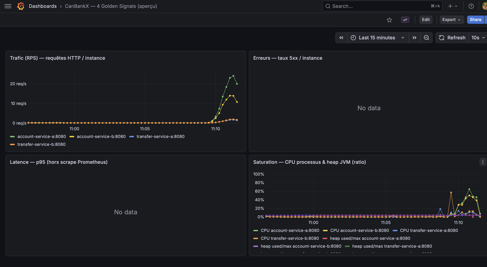

# Rapport comparatif — CanBankX (LOG430 Phase 1)

Ce document synthétise des **mesures réelles** obtenues avec **k6** sur la stack **microservices** (`docker-compose.lb.yml`). Les fichiers bruts d’export k6 sont dans [`metrics/`](metrics/).

| Champ | Valeur |
|--------|--------|
| **Date des mesures** | Micro §2 : 2026-03-27 ; monolithe §1 : 2026-03-29 |
| **Machine** | Poste de développement (Docker Desktop) |
| **Stack** | 2× `account-service`, 2× `transfer-service`, NGINX :8082, KrakenD :8090 |
| **Scénario k6** | [`loadtests/canbankx.js`](../loadtests/canbankx.js) — ~70 % GET balance, ~20 % GET ledger, ~10 % POST transfer ; `sleep(1)` entre itérations ; paliers 10 → 25 → 50 VUs (~1 min 50 s effectifs) |
| **Identités de test** | Client + 2 comptes issus de `scripts/seed-and-test.sh` (voir `docs/metrics/SEED_IDS.txt` si régénéré) |

---

## 1. Monolithe vs microservices (saga HTTP)

Préférer un **projet Compose distinct** du LB pour ne pas écraser `nginx` / `gateway` du micro : `-p canbankx_mono`.

**Depuis la racine du repo** (`ashleyguevarra_phase1_log430/`) :

```bash
docker compose -p canbankx_mono -f docker-compose.monolith.yml up -d
# Premier build : long (Maven dans l’image). Ensuite : même commande sans --build.

# Seed depuis l’hôte (KrakenD monolithe) — noter la ligne « CID_A=… AID_SRC=… AID_DST=… » en fin de script :
SEED_GATEWAY_URL=http://localhost:8091 bash scripts/seed-and-test.sh

# k6 + export JSON (remplacer les UUID) :
k6 run --summary-export=docs/metrics/k6-summary-8091.json \
  -e BASE_URL=http://localhost:8091 \
  -e CID_A=<CID> -e AID_SRC=<SRC> -e AID_DST=<DST> \
  loadtests/canbankx.js
```

*(Alternative dans un conteneur sur le réseau monolithe : `MONOLITH=1` + `http://monolith:8080` — voir commentaires dans `scripts/seed-and-test.sh`.)*

| Métrique | Monolithe (gateway **8091**) | Microservices (gateway **8090**) |
|----------|------------------------------|-----------------------------------|
| P95 latence HTTP | **0,38 s** (`http_req_duration` p(95)=377 ms) | **1,22 s** (voir §2) |
| RPS moyen (http_reqs) | **17,96 / s** | **14,74 / s** |
| % erreurs HTTP | **0 %** | **0 %** |
| Requêtes HTTP totales | 1 983 | 1 628 (voir §2) |
| Notes | Campagne **2026-03-29** ; 1 JVM, saga sans HTTP inter-services | Mesures §2 avec KrakenD |

**Export :** [`metrics/k6-summary-8091.json`](metrics/k6-summary-8091.json).

**Lecture (même machine, campagnes à quelques jours d’écart) :** sur cet essai, le monolithe affiche un **P95 plus bas** et un **RPS plus élevé** que KrakenD sur la stack micro — cohérent avec moins de saut réseau entre services, mais la comparaison reste indicative (charge, état des volumes, non reproductibilité stricte jour à jour).

---

## 2. NGINX direct vs KrakenD (même stack microservices)

Même script k6, même durée, mêmes identités ; seul `BASE_URL` change.

| Métrique | `http://localhost:8082` (NGINX direct) | `http://localhost:8090` (KrakenD) |
|----------|----------------------------------------|-------------------------------------|
| **P95** `http_req_duration` | **1,76 s** | **1,22 s** |
| **RPS** (`http_reqs`) | **13,78 / s** | **14,74 / s** |
| **% échecs** (`http_req_failed`) | **0 %** | **0 %** |
| **Requêtes totales** | 1 528 | 1 628 |
| **Latence moyenne** | 527 ms | 417 ms |

**Interprétation (campagne unique, non statistique) :** sur cet essai, le trafic via **KrakenD** a montré un **P95 plus bas** et un **débit légèrement plus élevé** qu’en frappant **NGINX** directement. La variance entre deux runs successifs peut être forte (JIT, cache OS, ordre des VUs). Pour un livrable solide, enchaîner **3 runs** par URL et reporter **médiane** ou **moyenne**.

Exports JSON : [`metrics/k6-summary-8082.json`](metrics/k6-summary-8082.json), [`metrics/k6-summary-8090.json`](metrics/k6-summary-8090.json).

**Commandes de reproduction :**

```bash
docker compose -p canbankx_lb -f docker-compose.lb.yml up -d --build
# seed (voir docs/TEST.md), puis :
k6 run --summary-export=docs/metrics/k6-summary-8082.json \
  -e BASE_URL=http://localhost:8082 \
  -e CID_A=<CID> -e AID_SRC=<SRC> -e AID_DST=<DST> \
  loadtests/canbankx.js
k6 run --summary-export=docs/metrics/k6-summary-8090.json \
  -e BASE_URL=http://localhost:8090 \
  -e CID_A=<CID> -e AID_SRC=<SRC> -e AID_DST=<DST> \
  loadtests/canbankx.js
```

---

## 3. Nombre d’instances (réplicas)

Configuration mesurée : **N = 2** par type de service (account, transfer), NGINX `least_conn`.

| N (réplicas par service) | P95 (HTTP) | RPS | Erreurs | Saturation (CPU / heap) |
|--------------------------|------------|-----|---------|-------------------------|
| **1** | *À mesurer* | *À mesurer* | *À mesurer* | Arrêter une instance (`docker stop canbankx_account_b` …) et retirer la ligne correspondante dans `nginx/nginx.conf`, puis `docker compose -p canbankx_lb -f docker-compose.lb.yml up -d` et relancer k6. |
| **2** (défaut, mesure §2 NGINX) | **1,76 s** | **13,78 / s** | **0 %** | Voir captures Grafana (panneau *Saturation*) pendant le run. |
| **3** | *À mesurer* | *À mesurer* | *À mesurer* | Dupliquer un service dans `docker-compose.lb.yml` + entrée `server` dans NGINX + cible Prometheus. |
| **4** | *À mesurer* | *À mesurer* | *À mesurer* | Idem. |

---

## 4. Cache consultation solde (optionnel)

`ConsultAccountService` utilise `@Cacheable` sur le solde ; les virements invalident le cache (`@CacheEvict`).

| Scénario | P95 GET balance | Charge DB |
|----------|-----------------|-----------|
| Après warm-up (répéter GET balance) | *À mesurer* (scénario k6 100 % balance recommandé) | Comparer `jdbc` / requêtes dans Grafana ou logs SQL |
| Après invalidation (POST transfer) | *À mesurer* | Pic de requêtes attendu après écriture |

---

## 5. NFR (exemple — à recaler sur *votre* cahier LOG430)

| Objectif type | Cible indicative | Résultat observé (campagne §2) | Statut |
|----------------|------------------|--------------------------------|--------|
| P95 requêtes API | &lt; 2 s (seuil k6 du script) | 1,22–1,76 s | Atteint |
| Taux d’erreur HTTP | &lt; 5 % | 0 % | Atteint |
| Débit | Non fixé dans le code | ~14 req/s HTTP utiles | Mesuré |
| Disponibilité | Démo / prototype | 0 % échec sur la campagne | Partiel (pas de test de panne automatisé ici) |

---

## 6. Observabilité — captures Grafana / Prometheus

1. Démarrer : `docker compose -p canbankx_lb -f docker-compose.lb.yml --profile monitoring up -d`
2. Ouvrir **Grafana** : http://localhost:3001 (admin / admin)
3. Ouvrir le dashboard **« CanBankX — 4 Golden Signals (aperçu) »**
4. Pendant ou juste après un run **k6** (ex. `BASE_URL=http://localhost:8090` ou `:8082`), capturer l’écran du dashboard.
5. Enregistrer l’image sous `docs/Images/` et la référencer ci-dessous (chemins relatifs au dossier `docs/` pour le PDF).

**Prometheus (compose LB, profil monitoring)** : http://localhost:19090 — utile pour une capture « cibles UP » (`/targets`) et une requête ad hoc sur `http_server_requests_seconds_bucket`.

### Capture réalisée (test de charge sur la stack micro)



**Lecture du dashboard :**

- **Trafic (RPS)** : pic net sur **account-service-a** et **account-service-b** pendant le run k6 ; les **transfer-service** restent plus bas (scénario majoritairement balance / ledger).
- **Erreurs (5xx)** : panneau vide (« No data ») = **aucun taux 5xx** enregistré sur la fenêtre affichée — cohérent avec un run sans erreurs HTTP côté serveur.
- **Latence (p95)** : panneau vide = les séries Prometheus utilisées (histogrammes `http_server_requests_seconds_bucket`, fenêtre **5m**, filtres) n’ont pas produit de points visibles **dans ce créneau** ; cela **ne contredit pas** les latences mesurées par **k6** (vue **client**, autre source et autre agrégation).
- **Saturation** : hausse du **CPU** des instances account en phase de charge ; le **heap** JVM reste modéré sur la capture.

**k6 et seuil `http_req_duration` :** le script [`loadtests/canbankx.js`](../loadtests/canbankx.js) impose `p(95)<2000` ms. Si k6 affiche `thresholds on metrics 'http_req_duration' have been crossed`, c’est que le **p(95) client** a dépassé **2 s** sur ce run (souvent vers le palier à 50 VUs) — **à distinguer** des checks HTTP (statut 200) qui peuvent rester entièrement verts. Pour le rapport : c’est une **limite de perf par rapport au seuil choisi**, pas nécessairement une panne applicative.

---

## Fichiers générés

| Fichier | Description |
|---------|-------------|
| `docs/metrics/k6-summary-8082.json` | Export k6 — NGINX :8082 |
| `docs/metrics/k6-summary-8090.json` | Export k6 — KrakenD :8090 |
| `docs/metrics/k6-summary-8091.json` | Export k6 — monolithe, KrakenD :8091 (2026-03-29) |
| `docs/Images/Grafana_Test.png` | Capture dashboard Grafana (§6) |
| `scripts/collect-k6-for-report.sh` | Regénère seed + les deux exports (IDs dans la sortie) |
