<div align="center">

<h3 style="text-align:center; font-size:14pt;">
ÉCOLE DE TECHNOLOGIE SUPÉRIEURE<br>
UNIVERSITÉ DU QUÉBEC
</h3>

<br><br>

<h3 style="text-align:center; font-size:15pt;">
Phase 1 <br> 
PRÉSENTÉ À <br> 
M. FABIO PETRILLO <br> 
DANS LE CADRE DU COURS <br>
<em>ARCHITECTURE LOGICIELLE</em> (LOG430-01)
</h3>

<br><br>

<h3 style="text-align:center; font-size:15pt;">
Phase 1 - Architecture basée par services (microservices)
</h3>

<br><br>

<h3 style="text-align:center; font-size:15pt;">
PAR
<br>
Ashley Lester Ian GUEVARRA, GUEA70370101
</h3>

<br><br>

<h3 style="text-align:center; font-size:15pt;">
MONTRÉAL, LE 8 MARS 2026
</h3>

<br><br>

</div>

<div style="page-break-before: always;"></div>

# Arc42 - CanBankX Banking API

# 1. Introduction et objectifs

## 1.1 Objectifs métier

Le projet **CanBankX Banking API** vise à concevoir une plateforme bancaire en ligne destinée aux investisseurs particuliers.

Dans la **Phase 1**, l’objectif est de livrer un **MVP fonctionnel** permettant de démontrer les capacités principales du système bancaire via une API REST sécurisée.

Les fonctionnalités principales implémentées sont :

- **UC-01 : Enregistrement d’un client**
- **UC-02 : Vérification KYC**
- **UC-03 : Ouverture d’un compte bancaire**
- **UC-04 : Consultation du solde et de l’historique**
- **UC-05 : Virement entre comptes**

Ces fonctionnalités constituent les bases du système et permettent de démontrer la faisabilité technique d’une plateforme bancaire moderne tout en respectant certaines exigences de sécurité et de traçabilité.

Objectifs principaux :

- Mettre en place une **architecture claire et maintenable**
- Fournir une **API REST sécurisée**
- Assurer la **traçabilité des opérations bancaires**
- Préparer le système pour une **évolution vers une architecture distribuée**

---

## 1.2 Aperçu des exigences

La Phase 1 vise à livrer un système capable de supporter les opérations bancaires de base suivantes :

- Création d’un client dans le système bancaire
- Validation de l’identité du client via un processus **KYC**
- Création d’un compte bancaire pour un client validé
- Consultation du solde et de l’historique des transactions
- Réalisation d’un **virement entre comptes**

Motivation :

- Respect des exigences **KYC** pour la création de clients
- Gestion sécurisée des comptes bancaires
- Traçabilité complète des opérations financières
- Mise en place d’une architecture conteneurisée avec **Docker**
- Mise en place d’un pipeline **CI/CD** pour automatiser la validation du projet

---

## 1.3 Objectifs de qualité

Le système doit respecter plusieurs objectifs de qualité afin d’assurer sa robustesse et sa maintenabilité.

| Priorité | Objectif | Scénario concret |
|---------|---------|----------------|
| Must | Performance | Les requêtes API (création client, consultation solde) doivent répondre en moins d’une seconde dans un environnement normal. |
| Must | Sécurité | Les accès à l’API sont protégés par authentification et les opérations critiques sont journalisées. |
| Must | Fiabilité | Une erreur lors d’un virement entraîne un rollback complet afin de garantir la cohérence des données. |
| Should | Observabilité | Toutes les actions importantes sont enregistrées dans les logs avec un horodatage. |
| Could | Évolutivité | L’architecture doit permettre une évolution vers une architecture microservices. |

---

## 1.4 Parties prenantes

| Rôle / Organisation | Description | Attentes vis-à-vis de l’architecture |
|--------------------|-------------|-------------------------------------|
| Clients de la banque | Utilisateurs finaux | Accès simple et sécurisé aux services bancaires |
| Équipe de développement | Étudiants LOG430 | Architecture claire, maintenable et testable |
| Architecte logiciel | Responsable de l’architecture | Documentation des décisions architecturales |
| Enseignant / Correcteur | Professeur LOG430 | Documentation complète et reproductible |
| CanBankX (organisation fictive) | Commanditaire du système | Respect des contraintes bancaires et réglementaires |
| Autorités réglementaires | Régulateurs financiers | Vérification KYC et auditabilité des transactions |

# 2. Contraintes architecturales

## 2.1 Contraintes techniques

Le système doit respecter plusieurs contraintes techniques imposées par le projet :

- **Langage principal** : Java
- **Framework** : Spring Boot
- **Architecture applicative** : séparation claire entre les couches Domain, Application et Infrastructure
- **API** : exposition d’une API RESTful avec routes versionnées et codes HTTP standards
- **Persistance** : base de données relationnelle PostgreSQL
- **Conteneurisation** : utilisation de Docker et docker-compose pour déployer les services
- **CI/CD** : pipeline automatisé incluant build, tests et validation du projet

Le système doit également maintenir une **séparation claire entre la logique métier et les couches d’infrastructure**, afin de faciliter la maintenance et l’évolution du système.

---

## 2.2 Contraintes métier et réglementaires

Le domaine bancaire impose certaines contraintes fonctionnelles et réglementaires :

- **Vérification KYC obligatoire** avant l’ouverture d’un compte bancaire
- **Traçabilité des transactions financières**
- **Audit des opérations critiques** (création de compte, virement, validation KYC)
- **Cohérence transactionnelle** lors des opérations financières

Ces contraintes garantissent la conformité du système aux exigences de sécurité et de régulation du secteur bancaire.

---

## 2.3 Contraintes organisationnelles

Le projet est réalisé dans le cadre du cours **LOG430 – Architecture logicielle**.

Les contraintes organisationnelles incluent :

- Livraison du **MVP pour la Phase 1**
- Documentation de l’architecture avec **Arc42 (sections 1–8)**
- Présentation des vues architecturales selon le modèle **4+1**
- Documentation des décisions architecturales via **ADR (Architecture Decision Records)**

Le projet doit être **facilement reproductible**, permettant l’installation et l’exécution du système via Docker.

---

## 2.4 Contraintes de performance et disponibilité

Bien que le système soit un prototype académique, certaines contraintes de qualité doivent être respectées :

- **Temps de réponse des API inférieur à 1 seconde** dans des conditions normales
- **Disponibilité minimale du service** pendant l’exécution des tests
- **Journalisation des requêtes et erreurs**
- **Observabilité du système** via logs structurés

Ces contraintes permettent de démontrer la robustesse et la fiabilité de l’architecture proposée.

# 3. Portée et contexte système

Le périmètre de la **Phase 1** est limité à un prototype permettant de démontrer les fonctionnalités
essentielles d’un système bancaire en ligne.

Les fonctionnalités principales couvertes sont :

- **UC-01 : Enregistrement d’un client**
- **UC-02 : Vérification KYC**
- **UC-03 : Ouverture d’un compte bancaire**
- **UC-04 : Consultation du solde et de l’historique**
- **UC-05 : Virement entre comptes**

Hors périmètre de la Phase 1 :

- paiements externes
- gestion de cartes bancaires
- intégration avec des systèmes bancaires réels
- services financiers avancés

Ces fonctionnalités pourront être ajoutées dans les phases ultérieures du système.

Le système est considéré comme une **boîte noire** recevant des requêtes via une API REST et orchestrant
les opérations internes nécessaires pour traiter les demandes des utilisateurs.

---

# 3.1 Contexte métier

Acteurs externes :

- **Client** : crée un compte, consulte ses informations et effectue des virements
- **Service KYC (simulé)** : vérifie l’identité des clients
- **Système bancaire externe (simulé)** : pourrait valider certaines opérations financières dans une version future

<p style="text-align: center;">
  <em>Figure 1. Contexte métier</em>
</p>

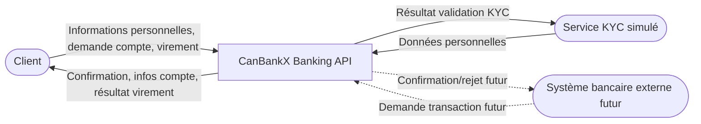

| Partenaire externe | Entrées vers CanBankX | Sorties de CanBankX |
|-------------------|----------------------|-------------------|
| Client | Informations personnelles, demande d’ouverture de compte, demande de virement | Confirmation d’inscription, informations de compte, résultat du virement |
| Service KYC (simulé) | Données personnelles du client | Résultat de la validation KYC |
| Système bancaire externe (futur) | Demande de transaction | Confirmation ou rejet de la transaction |

---

# 3.2 Contexte technique

Le système CanBankX interagit avec les utilisateurs et services externes via plusieurs interfaces techniques.

| Partenaire externe | Canal / Protocole | Usage principal |
|-------------------|------------------|----------------|
| Client | HTTP(S) / REST API | Création de client, consultation des comptes, virements |
| Service KYC (simulé) | Service interne | Validation de l’identité des clients |
| Base de données PostgreSQL | Connexion JDBC | Stockage des clients, comptes et transactions |

Les interactions principales utilisent :

- **HTTP(S) REST** pour les opérations bancaires
- **JSON** comme format d’échange de données
- **PostgreSQL** pour la persistance des données
- **Deux modes de déploiement** : **Monolith** (un conteneur) ou **Microservices** (account-service + transfer-service, database per service)

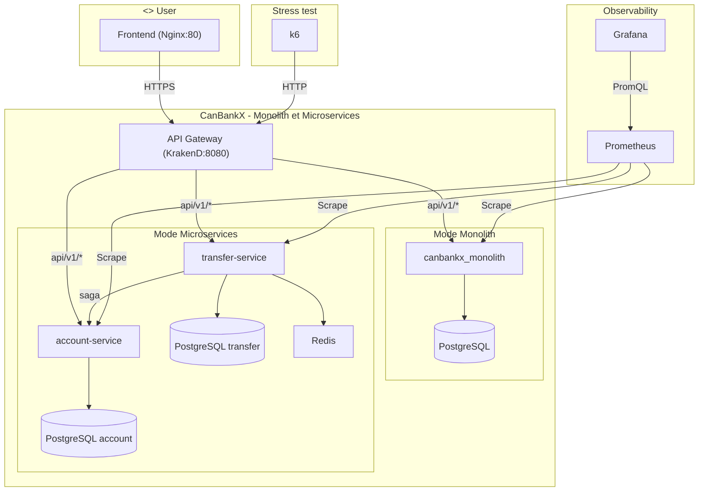

Cette architecture permet une **séparation claire entre l’API, la logique métier et la couche de persistance**.

# 4. Stratégie de solution

## Contenu

La stratégie de solution présente les décisions architecturales fondamentales qui structurent le système **CanBankX Banking API**.

Elle inclut :

- les choix technologiques
- les décisions de décomposition du système
- les stratégies retenues pour atteindre les objectifs de qualité
- les décisions organisationnelles liées au déploiement et au développement

Ces décisions permettent de garantir que le système pourra répondre aux exigences fonctionnelles et aux objectifs de qualité définis dans le projet.

---

## Motivation

Les décisions architecturales présentées constituent les fondations du système.  
Elles permettent de guider la mise en œuvre technique tout en assurant la satisfaction des objectifs suivants :

- **performance**
- **sécurité**
- **fiabilité**
- **observabilité**
- **évolutivité**

Ces choix permettent également de maintenir une architecture claire et maintenable dans le cadre d’un MVP académique.

---

## Décisions clés

### Technologie

Le système est développé en **Java avec le framework Spring Boot**.

Ce choix permet de bénéficier :

- d’un écosystème mature
- d’une bonne intégration avec les API REST
- d’une gestion simplifiée de la persistance via **JPA/Hibernate**
- d’outils robustes pour la gestion des applications backend

---

### Style architectural

L’architecture adoptée suit une **séparation claire des responsabilités**, divisée en plusieurs couches :

- **API / Controller** : exposition des endpoints REST
- **Service / Application** : implémentation de la logique métier
- **Repository / Infrastructure** : accès aux données

Cette structure facilite la maintenabilité du système et permet de séparer la logique métier des détails techniques.

---

### Persistance

La persistance des données est assurée par une **base de données relationnelle PostgreSQL**.

Les entités principales stockées dans la base de données incluent :

- clients
- comptes bancaires
- transactions

L’accès aux données est réalisé via **JPA/Hibernate**, ce qui simplifie la gestion des entités et des requêtes.

---

### Observabilité et fiabilité

Le système implémente plusieurs mécanismes pour garantir la fiabilité :

- journalisation des requêtes et des erreurs
- gestion transactionnelle pour garantir la cohérence des données
- rollback automatique en cas d’échec d’une opération critique (ex : virement)

---

### Organisation et déploiement

Le système est déployé dans un environnement conteneurisé grâce à **Docker et docker-compose**.

L’environnement comprend :

- un conteneur pour l’application **CanBankX Banking API**
- un conteneur pour la base de données **PostgreSQL**

Un pipeline **CI/CD** est également utilisé afin d’automatiser :

- la compilation du projet
- l’exécution des tests
- la validation du build

Cela permet de garantir la reproductibilité du système et de faciliter son déploiement.

---

## Justification

L’architecture choisie permet de répondre efficacement aux contraintes du projet.

Le choix de **Spring Boot** et **PostgreSQL** fournit une base robuste et largement utilisée dans l’industrie.

La conteneurisation avec **Docker** permet de simplifier le déploiement et d’assurer la reproductibilité de l’environnement.

Enfin, la séparation claire des couches applicatives facilite la maintenance du système et prépare une possible évolution vers une architecture distribuée.

# ADR-001 — Choix du style architectural

**Statut :** Accepté  
**Date :** 2026-03-08  
**Auteur :** Ashley Guevarra

## Contexte

Le projet CanBankX doit implémenter plusieurs cas d’utilisation bancaires via une API REST :

- enregistrement d’un client
- validation KYC
- ouverture d’un compte
- consultation du solde
- virement entre comptes

Il est nécessaire de choisir une structure logicielle qui facilite la séparation des responsabilités et la maintenabilité du code.

## Décision

Une architecture **en couches inspirée de l’architecture hexagonale** est adoptée.

Le projet est structuré en plusieurs couches :

- **API** : contrôleurs REST
- **Application** : orchestration des cas d’utilisation
- **Domain** : logique métier
- **Infrastructure** : persistance et accès aux ressources techniques

Cette structure permet une séparation claire entre logique métier et aspects techniques.

Le système supporte **deux modes de déploiement** avec la même architecture en couches : **Monolith** (un seul processus) et **Microservices** (account-service + transfer-service). Chaque microservice applique les mêmes couches (Domain, Application, Infrastructure).

## Conséquences

✅ code plus modulaire  
✅ logique métier isolée  
✅ tests plus faciles  
✅ déploiement flexible (Monolith ou Microservices)  

❌ structure initiale légèrement plus complexe

# ADR-002 — Idempotence et transactions pour les virements

**Statut :** Accepté  
**Date :** 2026-03-08  
**Auteur :** Ashley Guevarra

## Contexte

Les virements bancaires doivent être fiables et ne doivent jamais être exécutés plusieurs fois.

Dans une API REST, une requête peut être répétée à cause d’un timeout réseau ou d’un retry automatique.

## Décision

Un mécanisme **Idempotency-Key** est utilisé pour les opérations de virement.

Chaque requête de transfert doit inclure :

Idempotency-Key: <clé unique>

Le système vérifie si cette clé existe déjà :

- si oui → le transfert existant est retourné
- sinon → un nouveau transfert est créé

**Mode Monolith** : les opérations sont exécutées dans une **transaction de base de données** unique.

**Mode Microservices** : une **saga orchestrée** est utilisée (debit → credit → complete-ledger). L'idempotence des étapes internes est assurée via la table `saga_steps` et des verrous Redis. En cas d'échec, une compensation (compensate-debit) annule le débit.

## Conséquences

✅ évite les doubles virements  
✅ améliore la fiabilité de l’API  
✅ garantit la cohérence des données (transaction ou saga)  

❌ nécessite la gestion d’une clé d’idempotence et, en microservices, d’une saga

# ADR-003 — Observabilité (logs, métriques et monitoring)

**Statut :** Accepté  
**Date :** 2026-03-08  
**Auteur :** Ashley Guevarra

## Contexte

Il est nécessaire de pouvoir observer le comportement du système afin de détecter les erreurs et mesurer les performances.

Le projet CanBankX doit permettre d’analyser les **4 Golden Signals** :

- latence
- trafic
- erreurs
- saturation

## Décision

Une stratégie d’observabilité est mise en place :

- logs applicatifs structurés
- métriques exposées via **Spring Boot Actuator**
- collecte avec **Prometheus**
- visualisation via **Grafana**

Les métriques sont exposées via :

`/actuator/prometheus`

Des **tests de charge k6** permettent de comparer les performances Monolith vs Microservices dans des conditions identiques (même scénario, même charge).

## Conséquences

✅ meilleure visibilité sur le système  
✅ détection rapide des erreurs  
✅ comparaison Monolith vs Microservices (RPS, latence P95, taux d'erreur)  

❌ nécessite des composants supplémentaires (Prometheus, Grafana)

# 5. Vue des blocs de construction

## Contenu

La vue des blocs de construction décrit la décomposition statique du système **CanBankX Banking API** en différents blocs logiciels.

Elle présente les principaux modules du système ainsi que leurs relations et dépendances.

Cette vue permet de comprendre l’organisation du code source et la séparation des responsabilités entre les différentes couches du système.

---

## Motivation

Cette vue permet de :

- comprendre la structure globale du système
- expliquer l’organisation du code source
- faciliter la communication entre les développeurs et les parties prenantes
- illustrer les décisions architecturales décrites dans les ADR

La vue est organisée en plusieurs niveaux afin de présenter progressivement les détails de l’architecture.

---

# Niveau 1 — Système global CanBankX

Le système **CanBankX Banking API** est structuré selon une architecture en couches inspirée de l’architecture hexagonale.

Les principaux blocs sont :

- **API** : expose les endpoints REST et gère les requêtes HTTP
- **Application** : contient les services applicatifs qui orchestrent les cas d’utilisation
- **Domain** : contient la logique métier et les entités principales
- **Infrastructure** : gère les aspects techniques comme la persistance et l’accès à la base de données

Ces couches permettent de séparer clairement la logique métier des détails techniques.

Le système est également organisé autour de plusieurs modules métier principaux :

- **customer** : enregistrement des clients et gestion du statut KYC
- **account** : ouverture de comptes, consultation du solde et du ledger
- **transfer** : exécution des virements avec idempotence
- **ledger** : historisation comptable des mouvements
- **audit** : journalisation des opérations critiques

Diagramme de niveau 1 :

<p style="text-align: center;">
  <em>Figure 2. Diagramme Niveau 1</em>
</p>

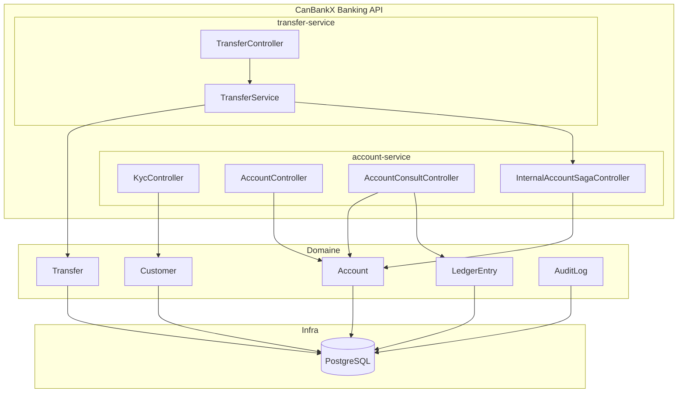

## Niveau 2 — Couche Domaine

La couche **Domain** contient les concepts métier du système bancaire.

Les principales entités sont :

- **Customer** : représente un client de la banque et son statut KYC
- **Account** : représente un compte bancaire appartenant à un client
- **Transfer** : représente une opération de virement entre deux comptes
- **LedgerEntry** : représente une écriture comptable de débit ou de crédit
- **AuditLog** : représente une trace des opérations critiques du système

Cette couche contient les règles métier principales du système et ne dépend pas des couches techniques. Les entités du domaine sont **identiques** en mode Monolith et en mode Microservices.

<p style="text-align: center;">
  <em>Figure 3. Diagramme Niveau 2 Couche Domaine</em>
</p>

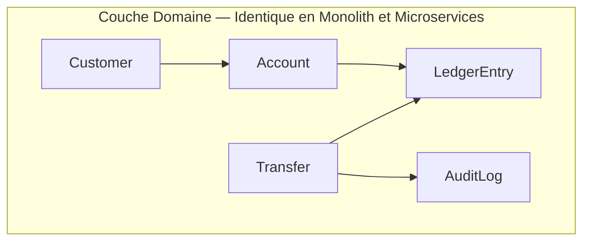

---

## Niveau 2 — Couche Application

La couche **Application** contient les services applicatifs qui orchestrent les cas d’utilisation.

Les principaux services identifiés dans le projet sont :

- **RegisterCustomerService** : création d’un nouveau client avec statut KYC initial `PENDING`
- **ApproveKycService** : validation KYC d’un client existant
- **OpenAccountService** : ouverture d’un compte bancaire pour un client approuvé
- **ConsultAccountService** : consultation du solde et de l’historique (ledger)
- **TransferService** : exécution des virements entre comptes avec gestion de l’idempotence

Ces services implémentent les règles métier du système et coordonnent les interactions entre les entités du domaine, les repositories et les mécanismes transverses comme l'audit. En **mode Monolith**, tous les services s'exécutent dans un seul processus. En **mode Microservices**, ils sont répartis entre account-service et transfer-service.

<p style="text-align: center;">
  <em>Figure 4. Diagramme Niveau 2 Couche Application</em>
</p>

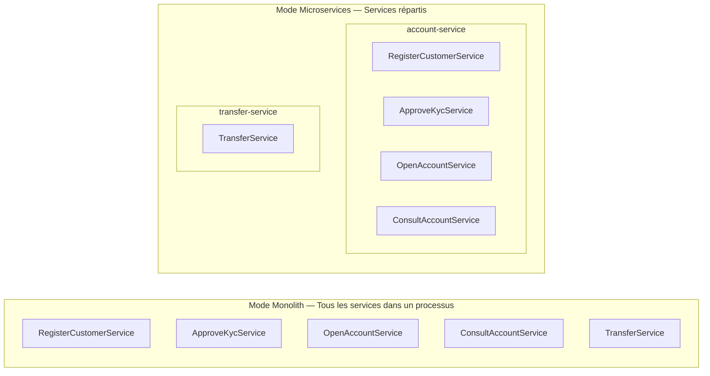

---

## Niveau 2 — Couche Infrastructure

La couche **Infrastructure** contient les implémentations techniques nécessaires au fonctionnement du système.

Elle inclut notamment :

- les contrôleurs REST exposant les endpoints HTTP :
  - **KycController**
  - **AccountController**
  - **AccountConsultController**
  - **TransferController**
- les repositories JPA :
  - **CustomerRepository**
  - **AccountRepository**
  - **TransferRepository**
  - **LedgerEntryRepository**
  - **AuditLogRepository**
- la configuration technique, notamment **SecurityConfig**
- la gestion centralisée des erreurs via **ApiExceptionHandler**
- l’accès à la base de données **PostgreSQL**

Cette couche dépend des autres couches mais celles-ci ne dépendent pas directement des détails techniques qu'elle implémente. En **mode Monolith**, un seul PostgreSQL et tous les contrôleurs/repositories dans un processus. En **mode Microservices**, database per service (PostgreSQL account, PostgreSQL transfer), Redis pour les verrous de saga, et contrôleurs répartis par service.

<p style="text-align: center;">
  <em>Figure 5. Diagramme Niveau 2 Couche Infrastructure</em>
</p>

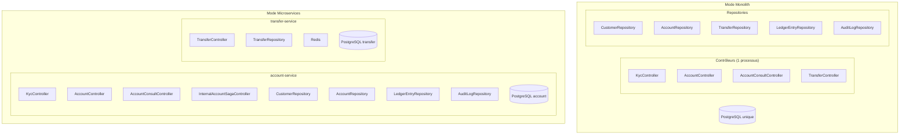

# 6. Vue dynamique (Runtime View)

## Contenu

La vue dynamique décrit le comportement concret du système **CanBankX Banking API** à l’exécution, sous forme de scénarios.

Ces scénarios illustrent :

- la réalisation des principaux cas d’utilisation
- les interactions entre les couches `api`, `application`, `domain` et `infrastructure`
- les échanges avec la base de données
- la gestion des erreurs et des validations métier

## Motivation

Cette vue permet de comprendre comment les différents composants du système collaborent à l’exécution des opérations bancaires.

Elle complète la vue statique des blocs de construction en montrant le déroulement réel des principaux cas d’utilisation.

## Forme

Les scénarios sont décrits à l’aide :

- de listes numérotées
- de diagrammes de séquence UML

Les cinq cas d’utilisation principaux du système sont présentés ci-dessous.

---

## Scénario 1 — UC-01 : Enregistrement d’un client

1. Le client envoie une requête HTTP `POST /api/v1/customers`.
2. `KycController` reçoit la requête et la transmet à `RegisterCustomerService`.
3. `RegisterCustomerService` valide les données reçues.
4. `RegisterCustomerService` crée un nouvel objet `Customer`.
5. `RegisterCustomerService` demande à `CustomerRepository` de sauvegarder le client.
6. Le repository persiste les données dans PostgreSQL.
7. La confirmation de création est retournée au contrôleur.
8. `KycController` retourne la réponse HTTP au client.

### Diagramme de séquence — UC-01

<p style="text-align: center;">
  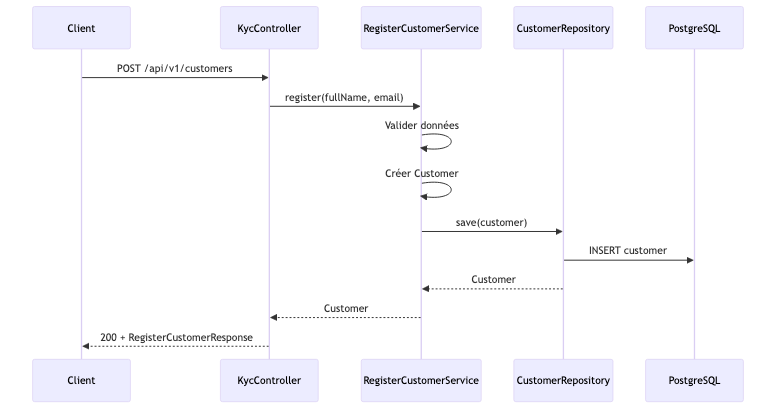
  <br>
  <em>Figure 6. Diagramme UC01</em>
</p>

## Scénario 2 — UC-02 : Vérification KYC

1. Le client ou l’administrateur envoie une requête HTTP `PATCH /api/v1/customers/{id}/kyc/approve`.
2. `KycController` reçoit la requête et la transmet à `ApproveKycService`.
3. `ApproveKycService` récupère le client via `CustomerRepository`.
4. Le service vérifie que le client existe.
5. Le statut KYC du client est mis à jour (APPROVED).
6. `CustomerRepository` persiste la modification dans la base de données.
7. `KycController` retourne la confirmation de la vérification KYC.

### Diagramme de séquence — UC-02

<p style="text-align: center;">
  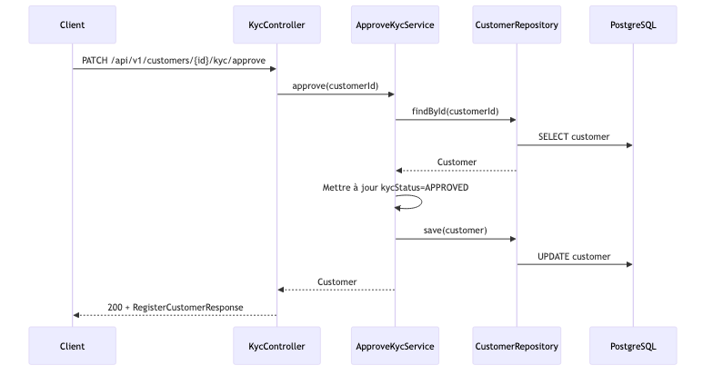
  <br>
  <em>Figure 7. Diagramme UC02</em>
</p>

---

# UC-03

## Scénario 3 — UC-03 : Ouverture d’un compte bancaire

1. Le client envoie une requête HTTP `POST /api/v1/customers/{customerId}/accounts`.
2. `AccountController` reçoit la requête et la transmet à `OpenAccountService`.
3. `OpenAccountService` vérifie que le client existe via `CustomerRepository`.
4. Le service vérifie que le statut KYC du client est approuvé.
5. Si le KYC n’est pas validé, une erreur est retournée.
6. Si le KYC est validé, un nouvel objet `Account` est créé.
7. `AccountRepository` persiste le compte dans PostgreSQL.
8. `AccountController` retourne la confirmation d’ouverture du compte.

### Diagramme de séquence — UC-03

<p style="text-align: center;">
  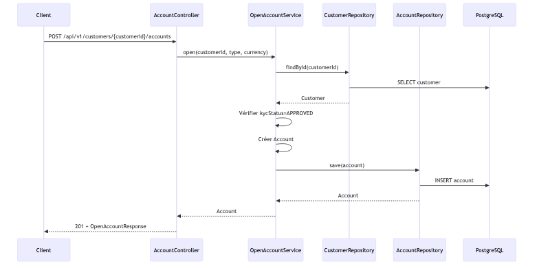
  <br>
  <em>Figure 8. Diagramme UC03</em>
</p>

---

# UC-04

## Scénario 4 — UC-04 : Consultation du solde et de l’historique

1. Le client envoie une requête HTTP `GET /api/v1/accounts/{id}/balance` (ou `GET /api/v1/accounts/{id}/ledger`) avec le header `X-Customer-Id`.
2. `AccountConsultController` reçoit la requête et la transmet à `ConsultAccountService`.
3. `ConsultAccountService` récupère le compte via `AccountRepository` et vérifie l’ownership.
4. Pour le solde : le service retourne `balanceCents`. Pour l’historique : `LedgerEntryRepository` retourne les écritures.
5. La réponse est retournée au contrôleur.
6. `AccountConsultController` retourne la réponse au client.

### Diagramme de séquence — UC-04

<p style="text-align: center;">
  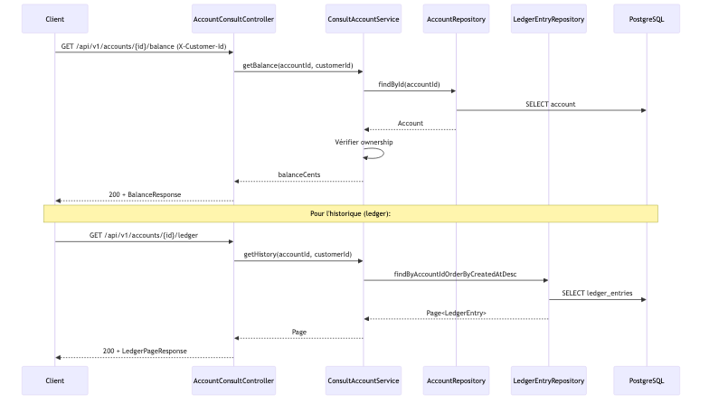
  <br>
  <em>Figure 9. Diagramme UC04</em>
</p>

---

# UC-05

## Scénario 5 — UC-05 : Virement entre comptes (Saga orchestrée)

1. Le client envoie une requête HTTP `POST /api/v1/transfers` avec une `Idempotency-Key` et `X-Customer-Id`.
2. La requête traverse KrakenD → NGINX → `TransferController` (transfer-service).
3. `TransferService` vérifie l’idempotence via `saga_steps` et crée un `Transfer` (PENDING).
4. `TransferService` appelle account-service : `POST /internal/saga/debit` (débit du compte source).
5. Si le débit échoue (solde insuffisant), le transfert reste FAILED.
6. Si le débit réussit, `TransferService` appelle `POST /internal/saga/credit` (crédit du compte destination).
7. Si le crédit échoue, `TransferService` appelle `POST /internal/saga/compensate-debit` pour annuler le débit.
8. Si tout réussit : enregistrement des écritures ledger (DEBIT, CREDIT), audit, statut COMPLETED.
9. `TransferController` retourne la confirmation du virement.

### Diagramme de séquence — UC-05 (Saga)

<p style="text-align: center;">
  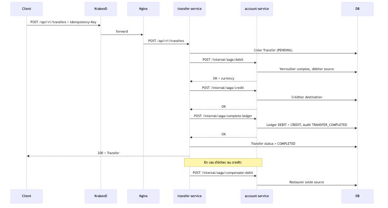
  <br>
  <em>Figure 10. Diagramme UC05 (Saga)</em>
</p>

### Observabilité et métriques d'exécution — Comparaison Monolith vs Microservices

Afin de **comparer le comportement du Monolith et des Microservices** sous charge, une infrastructure d'observabilité a été mise en place.

Les métriques applicatives sont collectées par **Prometheus** et visualisées via **Grafana** pour les deux modes de déploiement :

- **Mode Monolith** : un seul conteneur `canbankx_monolith`, une base PostgreSQL
- **Mode Microservices** : `account-service` + `transfer-service`, bases PostgreSQL distinctes, Redis

Le tableau de bord Grafana permet de suivre les **4 Golden Signals** pour chaque architecture :

- **Traffic** : nombre de requêtes par seconde (RPS)
- **Latency** : temps de réponse moyen des requêtes
- **Errors** : taux d’erreurs HTTP (4xx / 5xx)
- **Saturation** : utilisation des ressources (JVM heap memory)

Les campagnes de tests de charge réalisées avec **k6** permettent de comparer les deux architectures dans des conditions identiques (même scénario, même charge : 70 % balance, 20 % ledger, 10 % transfers, rampe 10→25→50 VUs).

#### Résultats comparatifs k6 — Monolith vs Microservices

| Métrique | Monolith (8091) | Microservices (8082/8090) |
|----------|-----------------|---------------------------|
| **RPS** (requêtes/s) | 18,6 | 18,1 |
| **Latence P95** (ms) | 202 | 316 |
| **Taux d'erreur** (%) | 0,00 | 0,00 |
| **http_req_failed** | 0/2050 | 0/2007 |

*Même scénario k6 (70 % balance, 20 % ledger, 10 % transfers, rampe 10→25→50 VUs).*

**Note** : Les résultats montrent une latence P95 plus faible pour le Monolith (202 ms vs 316 ms). Ce comportement est **attendu** dans ce contexte (une instance par architecture). Le Monolith évite les appels HTTP entre services (transfer-service → account-service pour la saga), ce qui réduit la latence. Les microservices sont privilégiés pour la scalabilité, l’indépendance des déploiements et la résilience — pas pour la performance brute en configuration mono-instance.

Les résultats permettent de visualiser les différences de comportement entre le Monolith (un seul processus) et les Microservices (plusieurs instances derrière le load balancer NGINX).

# 7. Vue de déploiement (Deployment View)

## Contenu

La vue de déploiement décrit l’infrastructure technique utilisée pour exécuter le système **CanBankX Banking API**, ainsi que la manière dont les composants logiciels sont déployés sur cette infrastructure.

Dans la Phase 1, le système est déployé sous forme d’une application **architecture microservices** (account-service, transfer-service) conteneurisée avec Docker.

Cette vue inclut :

1. Les environnements d’exécution
2. Les composants d’infrastructure
3. L’affectation des composants logiciels aux conteneurs
4. Le diagramme de déploiement

---

## Motivation

Le logiciel ne peut fonctionner sans une infrastructure sous-jacente. Cette infrastructure influence directement :

- la performance
- la sécurité
- la disponibilité
- la reproductibilité du système

Documenter cette vue permet de :

- montrer comment l’application est exécutée
- expliquer la communication entre les composants
- garantir la reproductibilité du déploiement via Docker
- préparer une future évolution vers une architecture distribuée

---

## 7.1 Environnements

### Développement local

Le système peut être exécuté localement via Docker :

**Mode Monolith** (un seul conteneur applicatif) :
```bash
docker compose -f docker-compose.monolith.yml up
```
- Ports : Gateway 8091, Nginx 8083

**Mode Microservices** (account-service + transfer-service) :
```bash
docker compose -f docker-compose.lb.yml up
```
- Ports : Gateway 8090, Nginx 8082

Cela permet de reproduire facilement l’environnement d’exécution et de comparer les deux architectures.

### Environnement de démonstration (VM)

Le système est également déployé sur une **machine virtuelle de démonstration** fournie dans le cadre du projet.

Le déploiement se fait via Docker et peut être reproduit en quelques minutes.

### Production (phase future)

Un environnement de production n’est pas couvert dans la Phase 1.

Cependant, l’architecture conteneurisée permettrait facilement une évolution vers :

- orchestration Kubernetes
- load balancing
- architecture microservices

## 7.2 Déploiement physique

Le système supporte deux modes de déploiement.

### Mode Monolith

Un seul conteneur applicatif (`canbankx_monolith`) exécute l’ensemble des fonctionnalités (account + transfer). Une base PostgreSQL partagée. Ports : Gateway 8091, Nginx 8083.

### Mode Microservices

L’infrastructure repose sur plusieurs conteneurs Docker.

### Conteneur canbankx_gateway

Point d’entrée API (KrakenD) exposant les routes publiques.

### Conteneur canbankx_nginx

Load balancer NGINX routant les requêtes vers les microservices.

### Conteneur canbankx_account_service

Microservice Java/Spring Boot gérant les clients, KYC, comptes et le ledger.

### Conteneur canbankx_transfer_service

Microservice Java/Spring Boot gérant les virements et l’orchestration de la saga UC-05.

### Conteneur canbankx_db_account

Base de données **PostgreSQL** du microservice account (customers, accounts, ledger_entries, audit_log, saga_steps).

### Conteneur canbankx_db_transfer

Base de données **PostgreSQL** du microservice transfer (transfers).

### Conteneur canbankx_redis_lb

Cache **Redis** pour la coordination de la saga (verrous distribués).

Les conteneurs communiquent via le **réseau Docker interne** `canbankx-net`.

---

## 7.3 Déploiement logique

Le déploiement logique décrit comment les composants logiciels du système CanBankX sont répartis sur l’infrastructure technique.

**Mode Monolith** : tous les composants (KycController, AccountController, TransferController, etc.) s’exécutent dans un seul conteneur, connecté à une base PostgreSQL partagée.

**Mode Microservices** : deux services applicatifs, une base PostgreSQL par service (database per service) et Redis.

| Composant logiciel | Infrastructure cible | Détails |
|--------------------|---------------------|--------|
| account-service | Conteneur `canbankx_account_service` | KycController, AccountController, AccountConsultController, InternalAccountSagaController |
| transfer-service | Conteneur `canbankx_transfer_service` | TransferController, orchestration saga UC-05 |
| Base account | Conteneur `canbankx_db_account` | PostgreSQL (customers, accounts, ledger, audit, saga_steps) |
| Cache | Conteneur `canbankx_redis_lb` | Redis (verrous saga) |
| Gateway | Conteneur `canbankx_gateway` | KrakenD (point d’entrée) |
| Load balancer | Conteneur `canbankx_nginx` | NGINX (routage) |
| Base transfer | Conteneur `canbankx_db_transfer` | PostgreSQL (transfers) |
| Réseau applicatif | `canbankx-net` | Réseau Docker interne |

## 7.4 Diagramme de déploiement

<p style="text-align: center;">
  <em>Figure 12. Diagramme Déploiement — Monolith et Microservices (style Test1)</em>
</p>

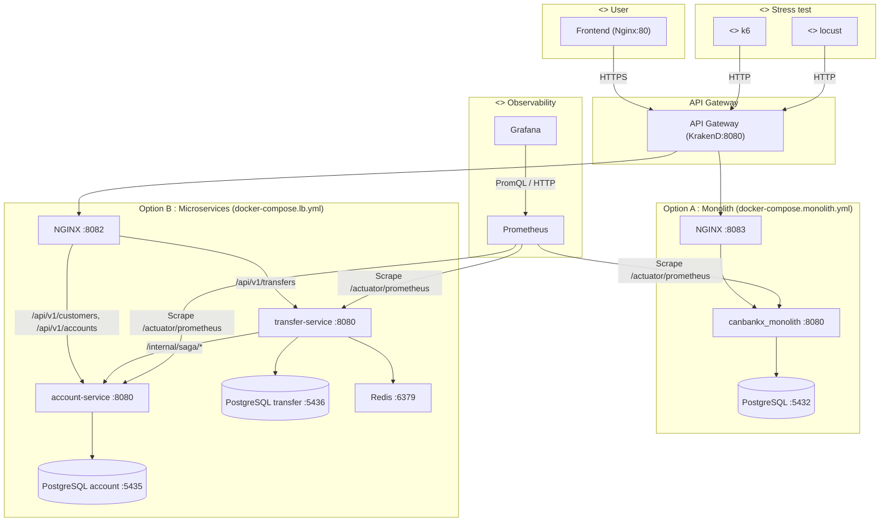

# 8. Concepts transverses (Cross-cutting Concepts)

## Contenu

Cette section décrit les règles globales et les solutions transverses utilisées dans l’architecture du système **CanBankX Banking API**.

Ces concepts s’appliquent à plusieurs parties du système et permettent d’assurer la cohérence globale de l’architecture.

Ils couvrent notamment :

- le modèle de domaine
- les aspects de sécurité
- les règles d’architecture
- les principes de développement
- les aspects opérationnels

## Motivation

Les concepts transverses garantissent l’intégrité de l’architecture.

Ils permettent :

- d’éviter la duplication de décisions architecturales
- de maintenir une cohérence dans l’ensemble du système
- de faciliter la maintenance et l’évolution future du système

Ces principes sont particulièrement importants dans un système bancaire où la fiabilité et la sécurité sont critiques.

---

# 8.1 Concepts de domaine

Le modèle de domaine du système CanBankX suit les principes du **Domain-Driven Design (DDD)**.

Les principales entités métier sont :

- **Customer** : représente un client enregistré dans le système.
- **Account** : représente un compte bancaire appartenant à un client.
- **Transfer** : représente un virement entre deux comptes.
- **LedgerEntry** : représente les écritures comptables associées à un transfert.
- **AuditLog** : enregistre les opérations critiques pour assurer la traçabilité du système.

Chaque entité encapsule une partie de la logique métier et définit les règles du domaine bancaire.

Le vocabulaire utilisé dans le code correspond au **langage métier** du système afin de maintenir une cohérence entre le modèle fonctionnel et l’implémentation logicielle.

---

# 8.2 Concepts UX

Le système CanBankX est principalement exposé via une **API REST**.

Les interactions avec le système sont réalisées par des clients HTTP tels que :

- Postman
- scripts automatisés
- applications clientes externes

Les principes UX appliqués incluent :

- utilisation de **codes HTTP standardisés**
- messages d’erreur explicites
- validation des entrées côté API
- retour immédiat du résultat des opérations

Les endpoints principaux couvrent les cas d’utilisation suivants :

- création de clients
- validation KYC
- ouverture de comptes
- consultation du solde et de l’historique
- virements entre comptes

---

# 8.3 Concepts de sécurité

La sécurité constitue un élément central de l’architecture du système CanBankX.

Les mécanismes suivants sont utilisés :

### Authentification

L’accès à l’API est protégé par un mécanisme d’authentification basé sur :

- identifiant utilisateur
- mot de passe sécurisé

### Protection des données

Les données sensibles sont protégées par plusieurs mécanismes :

- hachage des mots de passe avec **BCrypt**
- validation des entrées côté API
- gestion sécurisée des erreurs

### Traçabilité

Les opérations critiques sont enregistrées dans une table **AuditLog** afin de garantir la traçabilité des actions du système.

Cela permet notamment de tracer :

- création de comptes
- validation KYC
- virements entre comptes

---

# 8.4 Concepts d’architecture et de design

L’architecture du système est inspirée de l’**architecture hexagonale (Ports & Adapters)**.

L’application est organisée en plusieurs couches :

### API Layer

Contient les contrôleurs REST exposant les endpoints HTTP.

### Application Layer

Contient les services applicatifs qui orchestrent les cas d’utilisation.

### Domain Layer

Contient les entités métier et la logique métier principale.

### Infrastructure Layer

Contient les composants techniques tels que :

- les repositories JPA
- la configuration de persistance
- l’accès à la base de données

La persistance est gérée via **Hibernate/JPA** avec une base de données **PostgreSQL**.

Cette séparation permet de réduire le couplage entre la logique métier et les aspects techniques.

---

# 8.5 Concepts techniques et de développement

Le système est développé avec les technologies suivantes :

- **Java 17**
- **Spring Boot**
- **PostgreSQL**
- **Docker**

Les principes suivants sont appliqués :

### Tests

Les tests suivent une **pyramide de tests** :

- tests unitaires pour la logique métier
- tests d’intégration pour la base de données
- tests API pour les endpoints REST

### CI/CD

Un pipeline CI/CD permet d’automatiser :

- la compilation du projet
- l’exécution des tests
- la génération de l’image Docker

### Journalisation

Les logs applicatifs incluent :

- timestamp
- niveau de log
- messages d’erreur éventuels

Ces logs facilitent le diagnostic et l’analyse des incidents.

---

# 8.6 Concepts opérationnels

Le système est conteneurisé avec **Docker**.

**Mode Monolith** :
- un conteneur **canbankx_monolith** (toute la logique)
- une base **PostgreSQL** partagée
- `docker compose -f docker-compose.monolith.yml up`

**Mode Microservices** :
- un conteneur **canbankx_gateway** (KrakenD) et **canbankx_nginx** (NGINX) pour l’entrée et le routage
- un conteneur **canbankx_account_service** (comptes/KYC/ledger)
- un conteneur **canbankx_transfer_service** (virements et saga UC-05)
- **canbankx_db_account**, **canbankx_db_transfer** (PostgreSQL) et **canbankx_redis_lb** (Redis)
- `docker compose -f docker-compose.lb.yml up`

Les conteneurs communiquent via le réseau Docker interne **canbankx-net**.


Cela garantit :

- une installation reproductible
- un déploiement rapide sur la VM de démonstration
- une configuration cohérente entre les environnements.

# 9. Limites actuelles et évolutions prévues

La phase 1 du projet CanBankX met en place une architecture complète permettant d’implémenter les principaux cas d’utilisation du système bancaire tout en intégrant plusieurs mécanismes d’optimisation et d’observabilité.

L’architecture actuelle inclut notamment :

- une **API REST sécurisée**
- une **base de données PostgreSQL**
- une **observabilité avec Prometheus et Grafana**
- des **tests de charge avec k6**
- un **load balancing via NGINX**
- un **mécanisme de cache avec Redis**
- une **API Gateway avec KrakenD**

Ces éléments permettent déjà de mesurer et d’observer le comportement du système sous différentes conditions de charge.

Certaines améliorations architecturales pourraient néanmoins être explorées dans les phases ultérieures.

---

## 9.1 Découpage complet en microservices

L’architecture actuelle repose sur une **application monolithique modulaire** déployée sur plusieurs instances applicatives derrière un load balancer.

Cette approche permet de démontrer :

- la scalabilité horizontale
- la distribution de charge
- l’observabilité sous charge

Une évolution prévue pour la **phase 2 du projet** consistera à séparer les domaines métier en microservices indépendants.

L’architecture actuelle repose sur une application monolithique modulaire répliquée sur plusieurs instances derrière un load balancer, ce qui permet déjà de démontrer la scalabilité horizontale et la répartition de charge.

Dans la phase 2, les principaux domaines fonctionnels pourraient être séparés en services indépendants, par exemple :

- **Customer / KYC Service**
- **Account Service**
- **Transfer Service**
- **Audit / Ledger Service**

L’API Gateway **KrakenD**, déjà intégrée dans l’architecture actuelle, permettra de router les requêtes vers ces services de manière transparente.

---

## 9.2 Analyses de performance plus approfondies

Le projet inclut déjà des campagnes de tests de charge avec **k6**, ainsi que l’observation des métriques via **Prometheus** et **Grafana**.

Dans les phases futures, ces analyses pourraient être enrichies avec :

- des comparaisons systématiques entre **1, 2, 3 et 4 instances applicatives**
- une analyse détaillée de l’impact du **load balancing**
- des comparaisons entre **accès direct à l’API et accès via l’API Gateway**
- la production de tableaux et graphiques comparatifs (latence P95/P99, RPS, taux d’erreurs, saturation).

---

## 9.3 Tolérance aux pannes

L’architecture actuelle permet déjà la distribution des requêtes entre plusieurs instances applicatives grâce au **load balancer NGINX**.

Une amélioration future consisterait à démontrer plus explicitement la **tolérance aux pannes**, par exemple :

- arrêter une instance applicative pendant une campagne de tests de charge
- vérifier que le load balancer continue de distribuer les requêtes vers les autres instances
- observer l’impact sur les métriques collectées par Prometheus et visualisées dans Grafana.

---

## Conclusion

L’architecture actuelle constitue une base solide pour l’évolution du système CanBankX.

Les améliorations futures permettront de renforcer :

- la modularité du système
- la scalabilité
- la tolérance aux pannes
- l’analyse détaillée des performances.