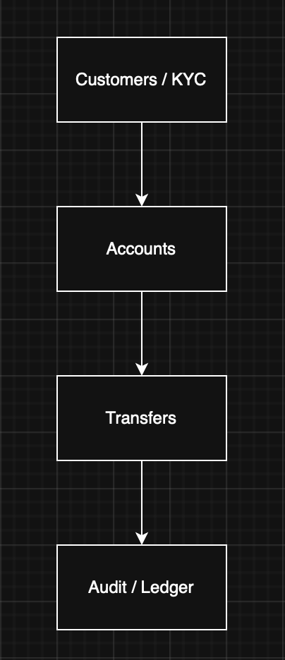
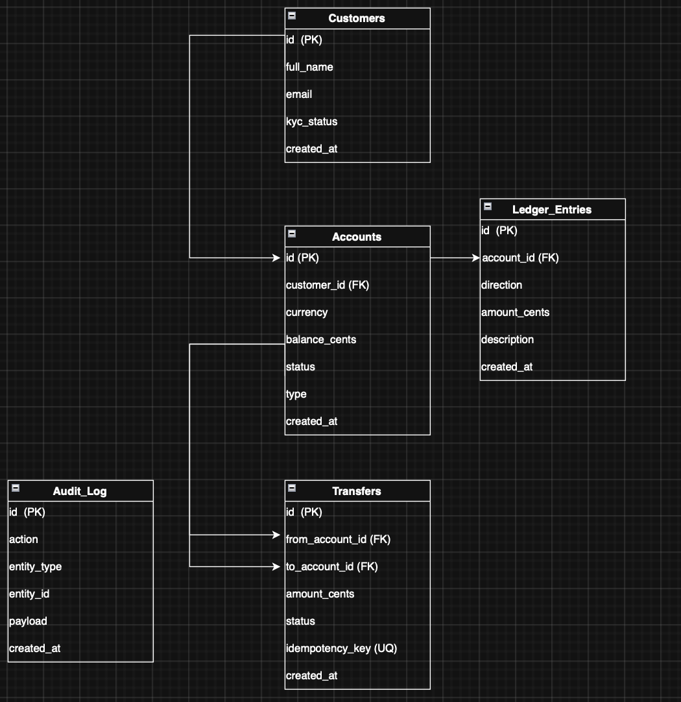

<div align="center">

<h3 style="text-align:center; font-size:14pt;">
ÉCOLE DE TECHNOLOGIE SUPÉRIEURE<br>
UNIVERSITÉ DU QUÉBEC
</h3>

<br><br>

<h3 style="text-align:center; font-size:15pt;">
Phase 1 <br> 
PRÉSENTÉ À <br> 
M. FABIO PETRILLO <br> 
DANS LE CADRE DU COURS <br>
<em>ARCHITECTURE LOGICIELLE</em> (LOG430-01)
</h3>

<br><br>

<h3 style="text-align:center; font-size:15pt;">
Phase 1 - Architecture basée par services (microservices)
</h3>

<br><br>

<h3 style="text-align:center; font-size:15pt;">
PAR
<br>
Ashley Lester Ian GUEVARRA, GUEA70370101
</h3>

<br><br>

<h3 style="text-align:center; font-size:15pt;">
MONTRÉAL, LE 8 MARS 2026
</h3>

<br><br>

</div>

<div style="page-break-before: always;"></div>

# BrokerX Banking API — Implémentation des cas d'utilisation

Ce projet implémente les premières fonctionnalités du système bancaire BrokerX sous forme d'une API REST développée avec **Java, Spring Boot, PostgreSQL et Docker**.

L’objectif de cette phase est de mettre en place le processus d’onboarding d’un client ainsi que la création d’un compte bancaire.

Cas d’utilisation implémentés :

- UC-01 — Enregistrement d’un client
- UC-02 — Vérification KYC
- UC-03 — Ouverture d’un compte bancaire
- UC-04 — Consultation du solde et de l’historique
- UC-05 — Virement entre comptes (idempotent)

La base de données est exécutée dans un conteneur **PostgreSQL Docker (`brokerx_db`)**.

---

# UC-01 — Enregistrement d’un client

### Acteur principal
Client

### Acteurs secondaires
Service Clients

### But
Créer un nouveau client dans le système.

### Préconditions
Aucune.

### Déclencheur
Un client soumet ses informations personnelles.

### Scénario nominal

1. Le client envoie une requête **POST /customers** avec son nom complet et son email.
2. Le système valide les informations.
3. Le système crée un client avec un **UUID unique**.
4. Le statut **KYC est initialisé à PENDING**.
5. Le système retourne l'identifiant du client.

### Commande de test

```bash
curl -s -u admin:admin -X POST http://localhost:8081/customers \
-H "Content-Type: application/json" \
-d '{"fullName":"John Doe","email":"john.doe@email.com"}'
```

### Réponse

```json
{
  "id": "UUID",
  "status": "PENDING"
}
```

### Postconditions

Un client est créé dans la base de données avec :

```
kyc_status = PENDING
```

---

# UC-02 — Vérification KYC

### Acteur principal
Service de conformité

### Acteurs secondaires
Service Clients, Service d’audit

### But
Vérifier l’identité du client afin de lui permettre d’utiliser le système bancaire.

### Préconditions

- Le client doit exister.
- Le client doit avoir un statut **KYC = PENDING**.

### Déclencheur
Le service de conformité approuve le client.

### Scénario nominal

1. Le système reçoit une requête **PATCH /customers/{id}/kyc/approve**.
2. Le système vérifie que le client existe.
3. Le système met à jour le statut KYC vers **APPROVED**.
4. Une entrée est ajoutée dans la table **audit_log** avec l’action **KYC_APPROVED**.
5. Le système retourne le nouveau statut.

### Commande de test

```bash
curl -i -X PATCH -u admin:admin \
"http://localhost:8081/customers/{id}/kyc/approve"
```

### Réponse

```json
{
  "id": "UUID",
  "status": "APPROVED"
}
```

### Postconditions

Le client possède maintenant :

```
kyc_status = APPROVED
```

et peut utiliser les fonctionnalités bancaires.

---

# UC-03 — Ouverture d’un compte bancaire

### Acteur principal
Client

### Acteurs secondaires
Service Comptes, Service d’audit

### But
Créer un compte bancaire afin de permettre les dépôts et les virements.

### Préconditions

- Le client doit être authentifié.
- Le client doit être **KYC VERIFIED (APPROVED)**.

### Déclencheur
Le client demande l’ouverture d’un compte.

### Scénario nominal

1. Le client envoie une requête **POST /customers/{customerId}/accounts**.
2. Le système valide :
   - le type de compte (CHECKING ou SAVINGS)
   - la devise (CAD ou USD).
3. Le système crée un nouveau compte avec :
   - statut **ACTIVE**
   - solde initial **0**.
4. Une entrée d’audit **ACCOUNT_OPENED** est créée dans **audit_log**.
5. Le système retourne l’identifiant et les informations du compte.

### Commande de test

```bash
curl -i -u admin:admin -X POST \
"http://localhost:8081/customers/{customerId}/accounts" \
-H "Content-Type: application/json" \
-d '{"type":"CHECKING","currency":"CAD"}'
```

### Réponse

```json
{
  "id": "ACCOUNT_ID",
  "customerId": "CUSTOMER_ID",
  "type": "CHECKING",
  "currency": "CAD",
  "status": "ACTIVE",
  "balanceCents": 0
}
```

### Postconditions

Un compte actif est créé dans la base de données :

```
status = ACTIVE
balance_cents = 0
```

Le compte est maintenant prêt pour effectuer des transactions.

---

# UC-04 — Consultation du solde et de l’historique

### Acteur principal
Client

### Acteurs secondaires
Service Comptes, Observabilité

### But
Permettre au client de consulter le **solde actuel** et **l’historique des transactions** d’un compte.

### Préconditions

- Le client doit être authentifié.
- Le compte doit appartenir au client.

Dans cette phase du projet, l’authentification est réalisée via **Basic Auth**.  
L’identifiant du client est transmis via le header :

```
X-Customer-Id
```

Ce mécanisme simule l’identité du client avant l’introduction d’un **JWT** dans les prochaines phases.

### Déclencheur

Le client souhaite consulter le solde ou l’historique de son compte.

### Scénario nominal

1. Le client envoie une requête **GET /accounts/{accountId}/balance** ou **GET /accounts/{accountId}/ledger**.
2. Le système valide l’authentification.
3. Le système récupère le **customerId** via le header `X-Customer-Id`.
4. Le système vérifie que le compte existe.
5. Le système vérifie que le compte appartient au client.
6. Le système retourne le solde ou l’historique paginé des transactions.

---

### Commande de test — Consulter le solde

```bash
curl -u admin:admin \
-H "X-Customer-Id: {customerId}" \
http://localhost:8081/accounts/{accountId}/balance
```

### Réponse

```json
{
  "accountId": "ACCOUNT_ID",
  "balanceCents": 0
}
```

---

### Commande de test — Consulter l’historique

```bash
curl -u admin:admin \
-H "X-Customer-Id: {customerId}" \
"http://localhost:8081/accounts/{accountId}/ledger?page=0&size=10"
```

### Réponse

```json
{
  "page": 0,
  "size": 10,
  "totalElements": 0,
  "totalPages": 0,
  "items": []
}
```
---

# UC-05 — Virement entre comptes (Idempotent + Audit)

### Acteur principal
Client

### Acteurs secondaires
Service Transferts, Base de données (transactions), Audit / Compliance

### But
Effectuer un virement entre deux comptes tout en garantissant l’absence de double débit grâce à une **Idempotency-Key**.

---

# Préconditions

- Client authentifié
- Compte source actif
- Solde suffisant
- Idempotency-Key fournie dans la requête

---

# Déclencheur

Le client envoie une requête **POST /transfers** pour transférer de l’argent d’un compte source vers un compte destination.

---

# Scénario nominal

1. Le client envoie une requête **POST /transfers** contenant :
   - `fromAccountId`
   - `toAccountId`
   - `amountCents`
   - `Idempotency-Key` dans le header.

2. Le système vérifie si un transfert avec cette **Idempotency-Key** existe déjà.

3. Si un transfert existe déjà :
   - Le système retourne le transfert existant (même `transfer_id`).

4. Sinon :
   - Le système valide :
     - que le montant est supérieur à 0
     - que les comptes existent
     - que le compte source appartient au client
     - que le solde est suffisant

5. Le système exécute une **transaction DB** :
   - crée un `transfer` avec statut **COMPLETED**
   - écrit deux `ledger_entries` :
     - **DEBIT** sur le compte source
     - **CREDIT** sur le compte destination
   - met à jour les soldes des comptes
   - écrit une entrée `audit_log` **TRANSFER_CREATED**

6. Le système retourne la confirmation du virement.

---

# Commandes de test — Création des clients

```bash
CID_A=$(curl -s -u admin:admin -X POST http://localhost:8081/customers \
  -H "Content-Type: application/json" \
  -d '{"fullName":"UC05 Client A","email":"uc05a@test.com"}' | sed -n 's/.*"id":"\([^"]*\)".*/\1/p')

curl -s -u admin:admin -X PATCH "http://localhost:8081/customers/$CID_A/kyc/approve"

CID_B=$(curl -s -u admin:admin -X POST http://localhost:8081/customers \
  -H "Content-Type: application/json" \
  -d '{"fullName":"UC05 Client B","email":"uc05b@test.com"}' | sed -n 's/.*"id":"\([^"]*\)".*/\1/p')

curl -s -u admin:admin -X PATCH "http://localhost:8081/customers/$CID_B/kyc/approve"
```

---

# Commandes de test — Création des comptes

```bash
AID_SRC=$(curl -s -u admin:admin -X POST "http://localhost:8081/customers/$CID_A/accounts" \
  -H "Content-Type: application/json" \
  -d '{"currency":"CAD","type":"CHECKING"}' | sed -n 's/.*"id":"\([^"]*\)".*/\1/p')

AID_DST=$(curl -s -u admin:admin -X POST "http://localhost:8081/customers/$CID_B/accounts" \
  -H "Content-Type: application/json" \
  -d '{"currency":"CAD","type":"CHECKING"}' | sed -n 's/.*"id":"\([^"]*\)".*/\1/p')
```

---

# Initialisation du solde du compte source

```bash
docker exec -i brokerx_db psql -U brokerx -d brokerx -c \
"UPDATE accounts SET balance_cents = 10000 WHERE id = '$AID_SRC';"
```

---

# Commande de test — Virement

```bash
IDEM_KEY="uc05-001"

curl -s -u admin:admin \
  -H "X-Customer-Id: $CID_A" \
  -H "Idempotency-Key: $IDEM_KEY" \
  -H "Content-Type: application/json" \
  -X POST http://localhost:8081/transfers \
  -d "{\"fromAccountId\":\"$AID_SRC\",\"toAccountId\":\"$AID_DST\",\"amountCents\":2500}"
```

---

# Réponse

```json
{
  "id": "fe84c117-799c-40ef-996a-e524a2583a47",
  "fromAccountId": "2eb490dc-64b1-4379-8d9e-cddb61b363b4",
  "toAccountId": "4cbef0f3-45fd-434b-a587-2d2546861d5a",
  "amountCents": 2500,
  "status": "COMPLETED",
  "createdAt": "2026-03-05T22:10:34.707530Z"
}
```

---

# Test d’idempotence

La même requête avec la même **Idempotency-Key** retourne le **même transfer_id**.

```bash
curl -s -u admin:admin \
  -H "X-Customer-Id: $CID_A" \
  -H "Idempotency-Key: uc05-001" \
  -H "Content-Type: application/json" \
  -X POST http://localhost:8081/transfers \
  -d "{\"fromAccountId\":\"$AID_SRC\",\"toAccountId\":\"$AID_DST\",\"amountCents\":2500}"
```

---

# Vérification des soldes

```bash
curl -s -u admin:admin -H "X-Customer-Id: $CID_A" \
"http://localhost:8081/accounts/$AID_SRC/balance"

curl -s -u admin:admin -H "X-Customer-Id: $CID_B" \
"http://localhost:8081/accounts/$AID_DST/balance"
```

### Réponse

```json
{
  "accountId": "2eb490dc-64b1-4379-8d9e-cddb61b363b4",
  "balanceCents": 7500
}
```

```json
{
  "accountId": "4cbef0f3-45fd-434b-a587-2d2546861d5a",
  "balanceCents": 2500
}
```

---

# Vérification du ledger

```bash
curl -s -u admin:admin -H "X-Customer-Id: $CID_A" \
"http://localhost:8081/accounts/$AID_SRC/ledger?page=0&size=10"

curl -s -u admin:admin -H "X-Customer-Id: $CID_B" \
"http://localhost:8081/accounts/$AID_DST/ledger?page=0&size=10"
```

### Réponse

```json
{
  "page": 0,
  "size": 10,
  "totalElements": 1,
  "totalPages": 1,
  "items": [
    {
      "direction": "DEBIT",
      "amountCents": 2500,
      "description": "TRANSFER fe84c117-799c-40ef-996a-e524a2583a47"
    }
  ]
}
```

```json
{
  "page": 0,
  "size": 10,
  "totalElements": 1,
  "totalPages": 1,
  "items": [
    {
      "direction": "CREDIT",
      "amountCents": 2500,
      "description": "TRANSFER fe84c117-799c-40ef-996a-e524a2583a47"
    }
  ]
}
```

---

# Vérification de l’audit

```bash
docker exec -i brokerx_db psql -U brokerx -d brokerx -c \
"SELECT action, entity_type, entity_id FROM audit_log ORDER BY created_at DESC LIMIT 5;"
```

### Résultat attendu

```
TRANSFER_CREATED | TRANSFER | fe84c117-799c-40ef-996a-e524a2583a47
```

---

# Extensions / Variantes — UC-01 (Enregistrement d’un client)

### E1 — Données invalides

Si les informations fournies ne respectent pas les contraintes de validation  
(ex. `fullName` vide ou trop court, email invalide) :

```
HTTP 400
VALIDATION_ERROR
```

Exemple :

```bash
curl -i -u admin:admin -X POST http://localhost:8081/customers \
-H "Content-Type: application/json" \
-d '{"fullName":"","email":"invalid-email"}'
```

---

### E2 — Client déjà existant

Si un client existe déjà avec le même email :

```
HTTP 409
CUSTOMER_ALREADY_EXISTS
```

Exemple :

```bash
curl -i -u admin:admin -X POST http://localhost:8081/customers \
-H "Content-Type: application/json" \
-d '{"fullName":"John Doe","email":"john.doe@email.com"}'
```

---

# Extensions / Variantes — UC-02 (Vérification KYC)

### E1 — Client introuvable

Si l’identifiant `{id}` ne correspond à aucun client dans le système :

```
HTTP 404
CUSTOMER_NOT_FOUND
```

Exemple :

```bash
curl -i -X PATCH -u admin:admin \
"http://localhost:8081/customers/00000000-0000-0000-0000-000000000000/kyc/approve"
```

---

### E2 — Statut KYC invalide

Si le client n’est pas dans l’état **PENDING** (ex. déjà APPROVED) :

```
HTTP 409
INVALID_KYC_STATE
```

Exemple :

```bash
curl -i -X PATCH -u admin:admin \
"http://localhost:8081/customers/{id}/kyc/approve"
```

---

### E3 — Client non autorisé

Si l’utilisateur n’est pas authentifié correctement :

```
HTTP 401
UNAUTHORIZED
```

Exemple :

```bash
curl -i -X PATCH \
"http://localhost:8081/customers/{id}/kyc/approve"
```

---

# Extensions / Variantes — UC-03 (Ouverture d’un compte bancaire)

## E1 — Devise non supportée

Si la devise demandée n’est pas supportée par le système :

```
HTTP 400
UNSUPPORTED_CURRENCY
```

Exemple :

```bash
curl -i -u admin:admin -X POST \
"http://localhost:8081/customers/{customerId}/accounts" \
-H "Content-Type: application/json" \
-d '{"type":"CHECKING","currency":"EUR"}'
```

---

## E2 — Client non autorisé / KYC manquant

Si le client n’a pas encore passé la vérification **KYC** :

```
HTTP 403
KYC_REQUIRED
```

Exemple :

```bash
curl -i -u admin:admin -X POST \
"http://localhost:8081/customers/{customerId}/accounts" \
-H "Content-Type: application/json" \
-d '{"type":"CHECKING","currency":"CAD"}'
```

---

# Extensions / Variantes — UC-04 (Consultation du solde et de l’historique)

## E1 — Compte introuvable

Si le compte demandé n’existe pas dans le système :

```
HTTP 404
ACCOUNT_NOT_FOUND
```

---

## E2 — Accès interdit (ownership)

Si le compte n’appartient pas au client :

```
HTTP 403
FORBIDDEN_RESOURCE
```

Exemple :

```bash
curl -i -u admin:admin \
-H "X-Customer-Id: 11111111-1111-1111-1111-111111111111" \
"http://localhost:8081/accounts/{accountId}/balance"
```

---

# Postconditions — UC-04

Aucune donnée n’est modifiée.

Le système retourne simplement :

- le **solde du compte**
- l’**historique des transactions**

Les requêtes sont également observables via les **métriques HTTP exposées par Spring Actuator**.

---

# Extensions / Variantes — UC-05 (Virement entre comptes)

## E1 — Idempotency-Key absente

Si la requête ne contient pas de **Idempotency-Key**, le système rejette la requête.

```
HTTP 400
IDEMPOTENCY_KEY_REQUIRED
```

Exemple :

```bash
curl -i -u admin:admin \
  -H "X-Customer-Id: $CID_A" \
  -H "Content-Type: application/json" \
  -X POST http://localhost:8081/transfers \
  -d "{\"fromAccountId\":\"$AID_SRC\",\"toAccountId\":\"$AID_DST\",\"amountCents\":100}"
```

---

## E2 — Solde insuffisant

Si le compte source ne possède pas un solde suffisant pour effectuer le virement :

```
HTTP 409
INSUFFICIENT_FUNDS
```

Exemple :

```bash
curl -i -u admin:admin \
  -H "X-Customer-Id: $CID_A" \
  -H "Idempotency-Key: uc05-no-money" \
  -H "Content-Type: application/json" \
  -X POST http://localhost:8081/transfers \
  -d "{\"fromAccountId\":\"$AID_SRC\",\"toAccountId\":\"$AID_DST\",\"amountCents\":99999999}"
```

---

## E3 — Compte destination invalide

Si le compte destination n'existe pas :

```
HTTP 404
ACCOUNT_NOT_FOUND
```

Exemple :

```bash
curl -i -u admin:admin \
  -H "X-Customer-Id: $CID_A" \
  -H "Idempotency-Key: uc05-bad-dst" \
  -H "Content-Type: application/json" \
  -X POST http://localhost:8081/transfers \
  -d "{\"fromAccountId\":\"$AID_SRC\",\"toAccountId\":\"00000000-0000-0000-0000-000000000000\",\"amountCents\":100}"
```

---

# Postconditions — UC-05

- Le virement est enregistré **une seule fois** grâce à l’**Idempotency-Key**.
- Deux écritures sont ajoutées dans `ledger_entries` :
  - **DEBIT** sur le compte source
  - **CREDIT** sur le compte destination
- Les soldes des comptes sont mis à jour.
- Une entrée `audit_log` est créée :

```
TRANSFER_CREATED
```

---

## Domain Map

<p style="text-align: center;">
  
  <br>
  <em>Figure 1. Domain Map</em>
</p>

Les bounded contexts interagissent de la manière suivante :
...

---

## Modèle de données (ER simplifié)

<p style="text-align: center;">
  
  <br>
  <em>Figure 2. ER Diagram</em>
</p>

Le modèle relationnel minimal de la phase 1 est structuré autour de cinq tables principales.
...

---
# CI / CD

Afin d'assurer la qualité et la reproductibilité des builds, un pipeline **CI/CD** a été mis en place avec **GitHub Actions**.

Ce pipeline est exécuté automatiquement à chaque **push** ou **pull request** sur le dépôt.

## Étapes du pipeline

Le pipeline effectue les étapes suivantes :

1. récupération du code source depuis le dépôt GitHub
2. installation de **Java 17**
3. compilation du projet avec **Maven**
4. exécution des **tests unitaires**
5. vérification que le projet peut être construit correctement

La commande principale exécutée dans le pipeline est :

```
./mvnw -B clean verify
```

Cette commande permet de :

- compiler le projet
- exécuter les tests
- vérifier l'intégrité du build

Si une étape échoue, le pipeline échoue également, ce qui empêche l'intégration de code défectueux.

## Objectif du CI/CD

Le pipeline CI/CD permet de :

- garantir que le projet compile correctement
- détecter rapidement les erreurs
- maintenir une base de code stable
- automatiser la validation des modifications

# Stratégie de mise en cache (Caching)

Afin d'améliorer les performances du système BrokerX, une **mise en cache avec Redis** a été implémentée pour certaines requêtes fréquemment consultées.

Le caching permet de réduire les accès répétés à la base de données et d'améliorer les temps de réponse pour les opérations de lecture.

## Technologies utilisées

La solution de caching repose sur les composants suivants :

- **Redis** comme cache distribué en mémoire
- **Spring Cache** pour l'abstraction de la mise en cache
- **Spring Boot Redis (`spring-boot-starter-data-redis`)** pour l'intégration avec Redis

Redis est exécuté comme **conteneur Docker** dans l'infrastructure du projet.

Architecture simplifiée :

```
Client → API BrokerX (Spring Boot) → Redis Cache → PostgreSQL
```

## Endpoint mis en cache

L'endpoint suivant a été sélectionné pour le caching :

```
GET /customers/{customerId}/accounts/{accountId}/balance
```

Cet endpoint est fréquemment utilisé par les clients pour consulter le solde de leur compte.

La mise en cache est implémentée dans la couche service :

```java
@Cacheable(
    value = "accountBalance",
    key = "#accountId.toString() + ':' + #customerId.toString()"
)
public long getBalance(UUID accountId, UUID customerId) {
    // lecture du solde depuis la base si absent du cache
}
```

# Arc42 — BrokerX Phase 1

## 1. Introduction et objectifs

Le projet **BrokerX Phase 1** consiste à concevoir et implémenter une **API REST bancaire** destinée à des investisseurs particuliers.

Cette première phase a pour objectifs de :

- implémenter les principaux cas d’utilisation métier du domaine bancaire
- exposer ces fonctionnalités via une API REST sécurisée
- assurer la persistance des données avec PostgreSQL
- garantir la cohérence transactionnelle des opérations critiques
- tracer les actions sensibles via un journal d’audit
- préparer l’évolution vers une architecture microservices plus complète

Les cas d’utilisation implémentés dans cette phase sont :

- **UC-01 — Enregistrement d’un client**
- **UC-02 — Vérification KYC**
- **UC-03 — Ouverture d’un compte bancaire**
- **UC-04 — Consultation du solde et de l’historique**
- **UC-05 — Virement entre comptes (idempotent)**

Les qualités attendues pour cette phase sont :

- **cohérence métier**
- **intégrité des données**
- **traçabilité**
- **sécurité minimale**
- **évolutivité**
- **observabilité**
- **performance acceptable sous charge modérée**

---

## 2. Contraintes d’architecture

Le projet doit respecter plusieurs contraintes techniques et académiques.

### Contraintes technologiques

- utilisation de **Java**
- utilisation de **Spring Boot**
- persistance avec **PostgreSQL**
- accès aux données via **Spring Data JPA**
- sécurisation minimale via **Spring Security / Basic Auth**
- exécution locale conteneurisée avec **Docker**
- documentation API avec **Swagger / OpenAPI**
- exposition des métriques via **Spring Boot Actuator** et **Micrometer**
- supervision avec **Prometheus** et **Grafana**
- possibilité d’intégrer **NGINX**, **KrakenD** et **Redis** dans l’architecture

### Contraintes métier

- un client doit être créé avec un statut **KYC = PENDING**
- un client doit être **KYC APPROVED** avant d’ouvrir un compte
- un compte doit appartenir à un seul client
- un virement ne doit pas produire de double débit
- chaque action critique doit être traçable via **audit_log**
- les écritures comptables doivent être conservées dans **ledger_entries**

### Contraintes de qualité

- l’API doit retourner des erreurs cohérentes au format JSON
- les transactions critiques doivent être atomiques
- les performances doivent rester acceptables sous charge modérée
- l’architecture doit pouvoir évoluer vers des **microservices**
- l’authentification actuelle doit pouvoir être remplacée plus tard par **JWT**

---

## 3. Contexte et périmètre du système

### 3.1 Vue de contexte métier

Le système BrokerX permet à un client bancaire :

- de s’enregistrer
- de faire approuver son identité (KYC)
- d’ouvrir un compte bancaire
- de consulter son solde
- de consulter l’historique de ses transactions
- d’effectuer un virement entre comptes

### 3.2 Acteurs externes

- **Client**  
  Utilise l’API pour gérer ses comptes, consulter son solde et effectuer des virements.

- **Service de conformité / Administrateur**  
  Approuve le statut KYC du client.

- **PostgreSQL**  
  Stocke les données métier : clients, comptes, virements, écritures comptables, audit.

- **Prometheus**  
  Collecte les métriques exposées par l’application.

- **Grafana**  
  Visualise les métriques et les dashboards.

- **NGINX**  
  Agit comme reverse proxy / load balancer devant plusieurs instances de l’application.

- **KrakenD API Gateway**  
  Peut centraliser l’accès aux routes de l’API dans une architecture plus distribuée.

- **Redis**  
  Peut servir de cache pour certaines requêtes de lecture fréquentes.

### 3.3 Vue de contexte technique simplifiée

```text
Client / Admin
      |
      v
BrokerX REST API (Spring Boot)
      |
      +--> PostgreSQL
      +--> Redis (cache)
      +--> /actuator/prometheus
                |
                v
           Prometheus
                |
                v
             Grafana
```

Dans les tests d’architecture avancés :

```text
Client
  |
  v
NGINX / KrakenD
  |
  v
brokerx_app1 / brokerx_app2
  |
  v
PostgreSQL
```

## 4. Stratégie de solution

La solution retenue repose sur une application **Spring Boot** organisée autour des concepts métier principaux du domaine bancaire.

### Principes retenus

- exposition d’une **API REST**
- séparation entre **contrôleurs, services, repositories et entités**
- persistance relationnelle avec **PostgreSQL**
- gestion transactionnelle pour les opérations critiques
- usage d’une **Idempotency-Key** pour les virements
- traçabilité **append-only** avec `audit_log`
- historisation comptable via `ledger_entries`
- instrumentation applicative via **Actuator / Prometheus**
- déploiement conteneurisé avec **Docker**

### Orientation architecturale

L’application suit une organisation modulaire proche d’un style :

**REST + couche applicative + persistance relationnelle**

avec séparation entre :

- exposition HTTP
- orchestration métier
- persistance
- aspects transversaux

Cette approche permet de conserver un projet simple pour la **phase 1** tout en préparant une migration vers une **architecture microservices** lors des phases suivantes.

### Bounded Contexts identifiés

Les bounded contexts principaux sont :

- **Customers / KYC**
- **Accounts**
- **Transfers**
- **Audit / Ledger**

Ces contextes structurent les responsabilités métier et facilitent la compréhension de l’architecture.

---

## 5. Vue des blocs de construction

### 5.1 Vue de haut niveau

Les principaux blocs fonctionnels du système sont les suivants :

#### Customers / KYC

Responsable de :

- l’enregistrement des clients
- la validation des informations de base
- la gestion du statut **KYC**
- l’approbation **KYC**

#### Accounts

Responsable de :

- l’ouverture des comptes bancaires
- la consultation du solde
- la consultation du **ledger**
- la vérification d’appartenance d’un compte à un client

#### Transfers

Responsable de :

- la validation métier du virement
- la vérification du solde disponible
- la gestion de l’**idempotence**
- l’exécution transactionnelle du transfert

#### Ledger

Responsable de :

- l’écriture des mouvements de **débit et de crédit**
- l’historique des opérations par compte

#### Audit

Responsable de :

- la journalisation des actions critiques
- la traçabilité des événements métier

#### Security / Validation / Error Handling

Responsable de :

- l’authentification **Basic Auth**
- la validation des entrées
- le format standardisé des erreurs

#### Observability

Responsable de :

- l’exposition des **métriques**
- la supervision du **trafic, des erreurs, de la latence et de la saturation**

### 5.2 Vue par structure de code

Structure principale du projet Spring Boot :

```
src
├── main
│   └── java
│       └── com/ashleyguevarra/phase1
│
│           ├── AshleyguevarraPhase1Log430Application.java
│
│           ├── config
│           │   └── SecurityConfig.java
│
│           ├── api
│           │   ├── ApiException.java
│           │   ├── ApiExceptionHandler.java
│           │   └── HealthController.java
│
│           ├── customer
│           │   ├── Customer.java
│           │   ├── CustomerRepository.java
│           │   ├── RegisterCustomerService.java
│           │   ├── ApproveKycService.java
│           │   ├── KycController.java
│           │   └── dto
│           │       ├── RegisterCustomerRequest.java
│           │       └── RegisterCustomerResponse.java
│
│           ├── account
│           │   ├── Account.java
│           │   ├── AccountRepository.java
│           │   ├── OpenAccountService.java
│           │   ├── ConsultAccountService.java
│           │   ├── AccountController.java
│           │   ├── AccountConsultController.java
│           │   └── dto
│           │       ├── BalanceResponse.java
│           │       ├── OpenAccountRequest.java
│           │       └── OpenAccountResponse.java
│
│           ├── transfer
│           │   ├── Transfer.java
│           │   ├── TransferRepository.java
│           │   ├── TransferService.java
│           │   ├── TransferController.java
│           │   └── dto
│           │       ├── CreateTransferRequest.java
│           │       └── TransferResponse.java
│
│           ├── ledger
│           │   ├── LedgerEntry.java
│           │   ├── LedgerEntryRepository.java
│           │   └── dto
│           │       ├── LedgerEntryResponse.java
│           │       └── LedgerPageResponse.java
│
│           └── audit
│               ├── AuditLog.java
│               └── AuditLogRepository.java
│
└── test
    └── java
        └── com/ashleyguevarra/phase1
            └── AshleyguevarraPhase1Log430ApplicationTests.java
```

### 5.3 Relations entre blocs

- **Customers / KYC** autorise ou non l’ouverture d’un compte  
- **Accounts** fournit les comptes source et destination utilisés par **Transfers**  
- **Transfers** produit des écritures dans **Ledger**  
- **Customers / KYC**, **Accounts** et **Transfers** alimentent **Audit**  
- **Observability** mesure l’activité HTTP et applicative sur l’ensemble du système  

---

# 6. Vue d’exécution

## 6.1 Scénario — Enregistrement d’un client

1. Le client envoie `POST /customers`
2. Le contrôleur REST reçoit la requête
3. Les données sont validées
4. Le service crée un nouveau client avec un **UUID**
5. Le statut **KYC = PENDING** est initialisé
6. Le client est persisté dans **PostgreSQL**
7. La réponse HTTP retourne l’identifiant et le statut

---

## 6.2 Scénario — Approbation KYC

1. L’administrateur / conformité envoie  
   `PATCH /customers/{id}/kyc/approve`
2. Le système vérifie que le client existe
3. Le système vérifie que le statut actuel est **PENDING**
4. Le statut passe à **APPROVED**
5. Une entrée **KYC_APPROVED** est ajoutée dans `audit_log`
6. La réponse retourne le nouveau statut

---

## 6.3 Scénario — Ouverture d’un compte

1. Le client envoie  
   `POST /customers/{customerId}/accounts`
2. Le système valide l’authentification
3. Le système vérifie que le client est **KYC APPROVED**
4. Le système valide le type de compte et la devise
5. Le système crée un compte **ACTIVE** avec `balance = 0`
6. Une entrée **ACCOUNT_OPENED** est ajoutée dans `audit_log`
7. Les informations du compte sont retournées

---

## 6.4 Scénario — Consultation du solde ou du ledger

1. Le client envoie  
   `GET /accounts/{accountId}/balance`  
   ou  
   `GET /accounts/{accountId}/ledger`
2. Le système lit **X-Customer-Id**
3. Le système vérifie que le compte existe
4. Le système vérifie que le compte appartient au client
5. Le système lit les données demandées
6. La réponse HTTP retourne le solde ou l’historique paginé

---

## 6.5 Scénario — Virement entre comptes idempotent

1. Le client envoie `POST /transfers`
2. Le système valide l’authentification et **X-Customer-Id**
3. Le système valide la présence de **Idempotency-Key**
4. Le système vérifie si cette clé a déjà été utilisée  
5. Si oui, il retourne le transfert existant

Sinon, le système valide :

- les comptes **source et destination**
- le **montant**
- l’appartenance du **compte source au client**
- le **solde disponible**

Puis :

1. Une **transaction DB** est ouverte
2. Le transfert est créé avec statut **COMPLETED**
3. Les soldes des comptes sont mis à jour
4. Deux écritures `ledger_entries` sont créées :
   - **DEBIT**
   - **CREDIT**
5. Une entrée **TRANSFER_CREATED** est ajoutée dans `audit_log`
6. La transaction est validée
7. La réponse HTTP retourne la confirmation du virement

---

## 6.6 Scénario — Lecture avec cache Redis

1. Le client appelle l’endpoint de consultation du solde
2. Le service applicatif vérifie le **cache Redis**
3. Si la valeur est en cache, la réponse est retournée immédiatement
4. Sinon, la valeur est lue depuis **PostgreSQL**
5. La valeur est mise en cache
6. La réponse est retournée

---

# 7. Vue de déploiement

## 7.1 Déploiement local minimal

Le déploiement local minimal comprend :

- application **Spring Boot**
- **PostgreSQL**
- **Prometheus**
- **Grafana**

```
[Client]
   |
   v
[BrokerX Spring Boot :8081]
   |
   +--> [PostgreSQL]
   +--> [/actuator/prometheus]
             |
             v
        [Prometheus]
             |
             v
          [Grafana]
```

---

## 7.2 Déploiement avec load balancer

Pour les tests de **load balancing**, l’architecture suivante est utilisée :

```
Client
  |
  v
NGINX :8082
  |
  +--> brokerx_app1
  |
  +--> brokerx_app2
  |
  v
PostgreSQL
```

Cette configuration permet :

- de distribuer les requêtes sur plusieurs instances  
- d’augmenter la disponibilité  
- de préparer l’évolutivité horizontale  

---

## 7.3 Déploiement avec API Gateway

Dans une architecture plus avancée, **KrakenD** peut être placé devant les services :

```
Client
  |
  v
KrakenD API Gateway
  |
  v
BrokerX services / instances
  |
  v
PostgreSQL
```

---

## 7.4 Déploiement avec cache

Lorsque **Redis** est activé :

```
Client
  |
  v
BrokerX API
  |
  +--> Redis
  |
  +--> PostgreSQL
```

---

## 7.5 Nœuds et responsabilités

- **BrokerX App** : logique métier, API REST, sécurité, validation  
- **PostgreSQL** : persistance durable  
- **Redis** : cache mémoire distribué  
- **NGINX** : reverse proxy et load balancing  
- **KrakenD** : API Gateway  
- **Prometheus** : collecte des métriques  
- **Grafana** : visualisation et dashboards  

# 8. Concepts transversaux

## 8.1 Sécurité

La phase 1 utilise une sécurité simple basée sur :

- **Basic Auth** pour protéger les endpoints
- **X-Customer-Id** pour simuler l’identité du client sur certains endpoints

Cette approche est temporaire et sera remplacée plus tard par un mécanisme plus robuste, par exemple **JWT**.

---

## 8.2 Validation

Les entrées sont validées au niveau REST avec les mécanismes de validation **Spring**.

Exemples :

- nom complet obligatoire
- email valide
- montant strictement positif
- devise supportée
- type de compte supporté

---

## 8.3 Gestion des erreurs

Les erreurs sont retournées dans un format JSON cohérent :

```json
{
  "timestamp": "2026-03-08T18:28:42.854893Z",
  "message": "Invalid request",
  "error": "VALIDATION_ERROR",
  "details": [
    {
      "field": "amountCents",
      "message": "must be greater than or equal to 1"
    }
  ]
}
```

Exemples de codes d’erreur :

- `VALIDATION_ERROR`
- `CUSTOMER_NOT_FOUND`
- `ACCOUNT_NOT_FOUND`
- `CUSTOMER_ALREADY_EXISTS`
- `INVALID_KYC_STATE`
- `INSUFFICIENT_FUNDS`
- `UNAUTHORIZED`
- `FORBIDDEN_RESOURCE`
- `IDEMPOTENCY_KEY_REQUIRED`

---

## 8.4 Persistance et intégrité

La persistance est assurée par **Spring Data JPA** et **PostgreSQL**.

Le modèle principal comprend :

- `customers`
- `accounts`
- `transfers`
- `ledger_entries`
- `audit_log`

Les contraintes importantes incluent :

- unicité de l’email client
- unicité de l’`idempotency_key`
- intégrité référentielle entre comptes, transferts et écritures comptables

---

## 8.5 Transactions

Les opérations critiques, notamment **UC-05**, sont exécutées dans une transaction SQL afin de garantir :

- **atomicité**
- **cohérence**
- absence d’état intermédiaire invalide

---

## 8.6 Idempotence

Le système utilise une **Idempotency-Key** pour les virements.

Cela permet :

- d’éviter le double débit
- de rendre l’opération rejouable sans effet secondaire supplémentaire
- d’assurer un comportement plus sûr face aux **retries réseau**

---

## 8.7 Audit et traçabilité

Les actions critiques produisent des entrées dans `audit_log`.

Exemples :

- `KYC_APPROVED`
- `ACCOUNT_OPENED`
- `TRANSFER_CREATED`

Le journal d’audit est de type **append-only**.

---

## 8.8 Ledger

Chaque transfert génère deux écritures :

- une écriture **DEBIT** sur le compte source
- une écriture **CREDIT** sur le compte destination

Cela permet de conserver un **historique comptable explicite et consultable**.

---

## 8.9 Observabilité

L’application expose des métriques via :

```
/actuator/prometheus
```

Les **4 Golden Signals** observés sont :

- latence
- trafic
- erreurs
- saturation

Les métriques sont collectées par **Prometheus** et visualisées dans **Grafana**.

---

## 8.10 Performance et mise à l’échelle

La stratégie de performance comprend :

- mise en cache **Redis** pour certaines lectures fréquentes
- possibilité de déployer plusieurs instances **Spring Boot**
- usage de **NGINX** pour répartir la charge
- usage d’une **API Gateway** pour centraliser les accès

---

## 8.11 Évolutivité

L’architecture actuelle prépare les évolutions suivantes :

- passage progressif à une **architecture microservices**
- ajout d’une **API Gateway**
- remplacement de **Basic Auth par JWT**
- montée en charge **horizontale**
- optimisation des endpoints fortement sollicités