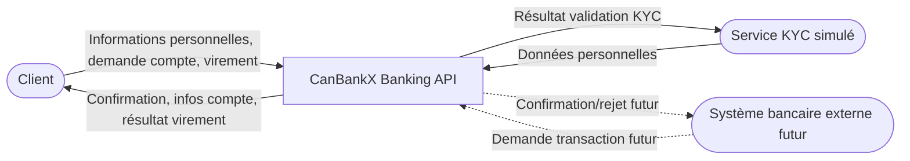
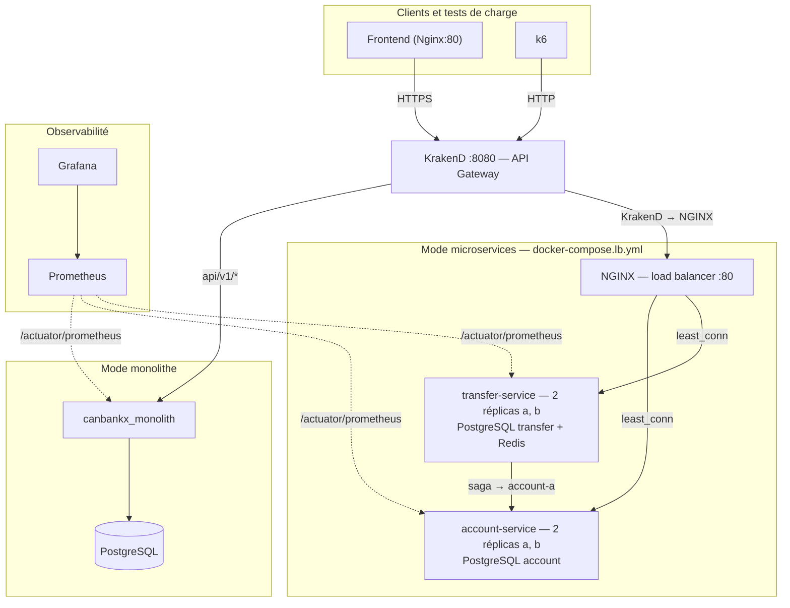
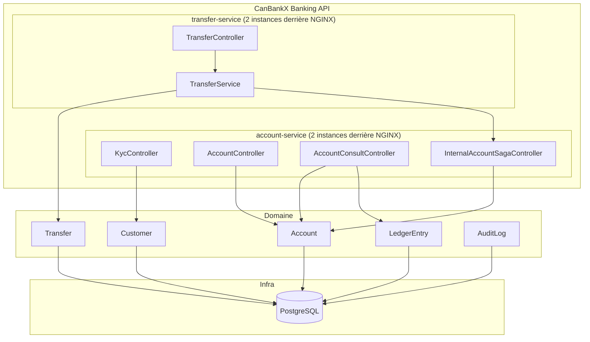
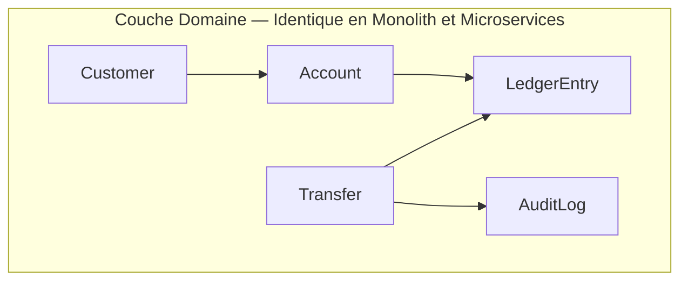
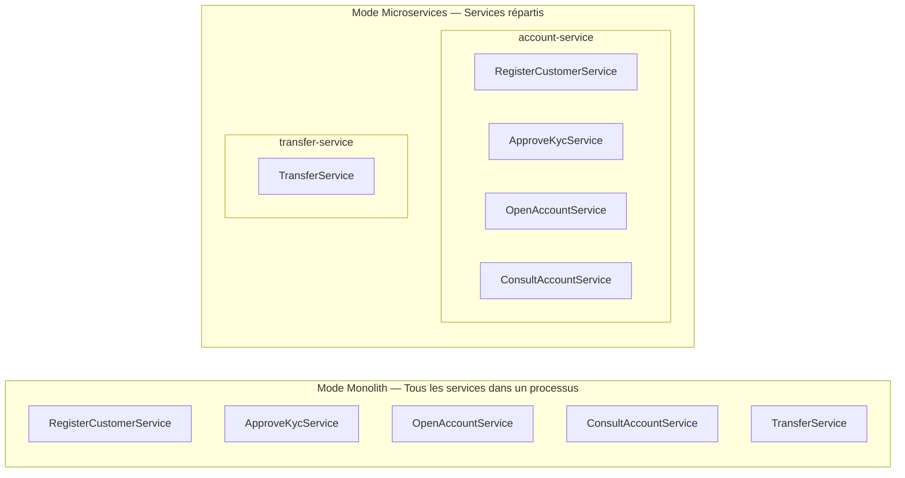
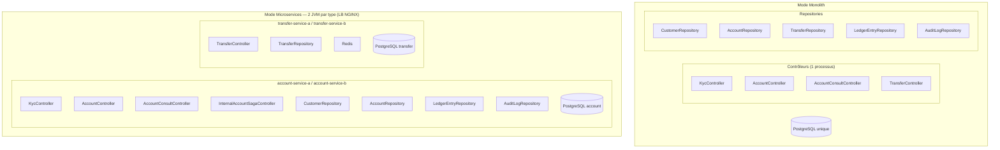
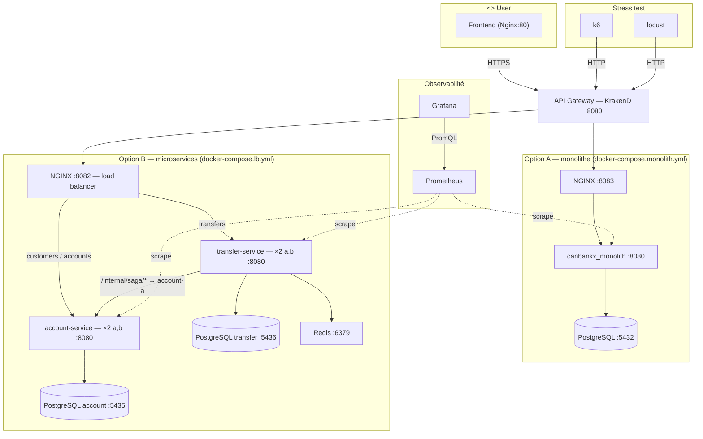

# Archive — sources Mermaid pour `arc42.md`

Fichier de référence uniquement. Les figures utilisées dans le document sont les PNG dans `docs/Images/` (`fig01_…` à `fig07_…`).

Pour régénérer un PNG : copier le contenu d’un bloc `mermaid` (sans la ligne ` ```mermaid `) dans un fichier `.mmd`, ou coller sur [mermaid.live](https://mermaid.live), puis exporter. Exemple avec `mmdc` :

```bash
mmdc -i mon_diagramme.mmd -o ../Images/fig01_3_1_contexte_metier.png
```

---

## `fig01_3_1_contexte_metier.png` — §3.1 Contexte métier



---

## `fig02_3_2_contexte_technique.png` — §3.2 Contexte technique

Version **simplifiée** (réplicas regroupés) — fichier source : `diagrams/arc42-gen/fig02_3_2_contexte_technique.mmd`.



---

## `fig03_5_niveau1.png` — §5 Niveau 1



---

## `fig04_5_n2_domaine.png` — §5 Niveau 2 domaine



---

## `fig05_5_n2_application.png` — §5 Niveau 2 application



---

## `fig06_5_n2_infrastructure.png` — §5 Niveau 2 infrastructure



---

## `fig07_7_deploiement.png` — §7 Déploiement

Version **simplifiée** — fichier source : `diagrams/arc42-gen/fig07_7_deploiement.mmd`.


